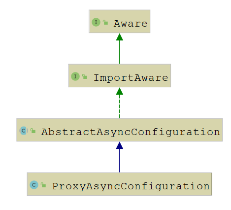

# 线程池

## 始

​		多线程是项目扩大以后，必不可少需要应用到的技术。线程池的应用，更加便利多线程的使用。 Java 默认支持线程池，在 Java 线程池的基础上，Pivotal 在 Spring 框架内，提供了 Spring 线程池。两者皆是主流的线程池。

### 基本概念

- 线程池，本质上是一种对象池，用于管理线程资源。
- 在任务执行前，需要从线程池中拿出线程来执行。
- 在任务执行完成之后，需要把线程放回线程池。
- 通过线程的这种反复利用机制，可以有效地避免直接创建线程所带来的坏处。

#### 优势

1. 降低资源的消耗。线程本身是一种资源，创建和销毁线程会有CPU开销；创建的线程也会占用一定的内存。
2. 提高任务执行的响应速度。任务执行时，可以不必等到线程创建完之后再执行。
3. 提高线程的可管理性。线程不能无限制地创建，需要进行统一的分配、调优和监控。

#### 缺点

1. 频繁的线程创建和销毁会占用更多的CPU和内存
2. 频繁的线程创建和销毁会对 GC 产生比较大的压力
3. 线程太多，线程切换带来的开销将不可忽视
4. 线程太少，多核CPU得不到充分利用，是一种浪费

#### 线程池处理流程


1. 判断核心线程池是否已满，如果不是，则创建线程执行任务
2. 如果核心线程池满了，判断队列是否满了，如果队列没满，将任务放在队列中
3. 如果队列满了，则判断线程池是否已满，如果没满，创建线程执行任务
4. 如果线程池也满了，则按照拒绝策略对任务进行处理


## Java 线程池

`JDK` 里 `ThreadPoolExecutor` 的线程池处理流程


[^corePool]: 核心线程池
[^maximumPool]: 线程池
[^BlockQueue]: 队列
[^RejectedExecutionHandler]: 拒绝策略


### 入门案例

```java
public class ThreadPoolTest {
    public static void main(String[] args) {
        ExecutorService executor = Executors.newFixedThreadPool(5);
        for (int i = 0; i < 10; i++) {
            executor.submit(() -> {
                System.out.println("thread id is: " + Thread.currentThread().getId());
                try {
                    Thread.sleep(1000L);
                } catch (InterruptedException e) {
                    e.printStackTrace();
                }
            });
        }
    }
}
```

​		在这个例子中，我们首先创建了一个固定长度为5的线程池。然后使用循环的方式往线程池中提交了10个任务，每个任务休眠1秒。在任务休眠之前，将任务所在的线程id进行打印输出。所以，理论上只会打印5个不同的线程id，且每个线程id会被打印2次。


### Executors-Java线程池

`Executors`是一个线程池工厂，提供了很多的工厂方法。

```java
// 创建单一线程的线程池
public static ExecutorService newSingleThreadExecutor();
// 创建固定数量的线程池
public static ExecutorService newFixedThreadPool(int nThreads);
// 创建带缓存的线程池
public static ExecutorService newCachedThreadPool();
// 创建定时调度的线程池
public static ScheduledExecutorService newScheduledThreadPool(int corePoolSize);
// 创建流式（fork-join）线程池
public static ExecutorService newWorkStealingPool();
```

#### 创建单一线程的线程池

顾名思义，这个线程池只有一个线程。若多个任务被提交到此线程池，那么会被缓存到队列（队列长度为`Integer.MAX_VALUE`）。当线程空闲的时候，按照FIFO的方式进行处理。

#### 创建固定数量的线程池

和 `创建单一线程的线程池` 类似，只是这儿可以并行处理任务的线程数更多一些罢了。若多个任务被提交到此线程池，会有下面的处理过程。

1. 如果线程的数量未达到指定数量，则创建线程来执行任务
2. 如果线程池的数量达到了指定数量，并且有线程是空闲的，则取出空闲线程执行任务
3. 如果没有线程是空闲的，则将任务缓存到队列（队列长度为`Integer.MAX_VALUE`）。当线程空闲的时候，按照FIFO的方式进行处理

#### 创建带缓存的线程池

这种方式创建的线程池，核心线程池的长度为0，线程池最大长度为`Integer.MAX_VALUE` 。由于本身使用`SynchronousQueue` 作为等待队列的缘故，导致往队列里面每插入一个元素，必须等待另一个线程从这个队列删除一个元素。

#### 创建定时调度的线程池

和上面3个工厂方法返回的线程池类型有所不同，它返回的是`ScheduledThreadPoolExecutor`类型的线程池。平时我们实现定时调度功能的时候，可能更多的是使用第三方类库，比如：quartz等。但是对于更底层的功能，我们仍然需要了解。下面是案例

```java
public class ThreadPoolTest {
    public static void main(String[] args) {
        ScheduledExecutorService executor = Executors.newScheduledThreadPool(2);
        // 定时调度，每个调度任务会至少等待`period`的时间，
        // 如果任务执行的时间超过`period`，则等待的时间为任务执行的时间
        executor.scheduleAtFixedRate(() -> {
            try {
                Thread.sleep(10000);
                System.out.println(System.currentTimeMillis() / 1000);
            } catch (InterruptedException e) {
                e.printStackTrace();
            }
        }, 0, 2, TimeUnit.SECONDS);
        // 定时调度，第二个任务执行的时间 = 第一个任务执行时间 + `delay`
        executor.scheduleWithFixedDelay(() -> {
            try {
                Thread.sleep(5000);
                System.out.println(System.currentTimeMillis() / 1000);
            } catch (InterruptedException e) {
                e.printStackTrace();
            }
        }, 0, 2, TimeUnit.SECONDS);

        // 定时调度，延迟`delay`后执行，且只执行一次
        executor.schedule(() -> System.out.println("5 秒之后执行 schedule"), 5, TimeUnit.SECONDS);
    }
}
```

上述代码不同调度方法简述：

1. `scheduleAtFixedRate(Runnable command, long initialDelay, long period, TimeUnit unit)`，定时调度，每个调度任务会至少等待 `period` 的时间，如果任务执行的时间超过`period`，则等待的时间为任务执行的时间

2. `scheduleWithFixedDelay(Runnable command, long initialDelay, long delay, TimeUnit unit)`，定时调度，第二个任务执行的时间 = 第一个任务执行时间 + `delay

3. `schedule(Runnable command, long delay, TimeUnit unit)`，定时调度，延迟`delay`后执行，且只执行一次

### 手动创建线程池

​		理论上，我们可以通过`Executors`来创建线程池，这种方式非常简单。但正是因为简单，所以限制了线程池的功能。比如：无长度限制的队列，可能因为任务堆积导致OOM，这是非常严重的bug，应尽可能地避免。怎么避免？归根结底，还是需要我们通过更底层的方式来创建线程池。

​		抛开定时调度的线程池不管，我们看看`ThreadPoolExecutor`。它提供了好几个构造方法，但是最底层的构造方法却只有一个。那么，我们就从这个构造方法着手分析。

```java
public ThreadPoolExecutor(int corePoolSize,
                          int maximumPoolSize,
                          long keepAliveTime,
                          TimeUnit unit,
                          BlockingQueue<Runnable> workQueue,
                          ThreadFactory threadFactory,
                          RejectedExecutionHandler handler);
```

参数解析：

1. `corePoolSize`，线程池中的核心线程数
2. `maximumPoolSize`，线程池中的最大线程数
3. `keepAliveTime`，空闲时间，当线程池数量超过核心线程数时，多余的空闲线程存活的时间，即：这些线程多久被销毁。
4. `unit`，空闲时间的单位，可以是毫秒、秒、分钟、小时和天，等等
5. `workQueue`，等待队列，线程池中的线程数超过核心线程数时，任务将放在等待队列，它是一个`BlockingQueue`类型的对象
6. `threadFactory`，线程工厂，我们可以使用它来创建一个线程
7. `handler`，拒绝策略，当线程池和等待队列都满了之后，需要通过该对象的回调函数进行回调处理

#### 等待队列-workQueue

等待队列是`BlockingQueue`类型的，理论上只要是它的子类，我们都可以用来作为等待队列。

同时，jdk内部自带一些阻塞队列，我们来看看大概有哪些。

1. `ArrayBlockingQueue`，队列是有界的，基于数组实现的阻塞队列
2. `LinkedBlockingQueue`，队列可以有界，也可以无界。基于链表实现的阻塞队列
3. `SynchronousQueue`，不存储元素的阻塞队列，每个插入操作必须等到另一个线程调用移除操作，否则插入操作将一直处于阻塞状态。该队列也是`Executors.newCachedThreadPool()`的默认队列
4. `PriorityBlockingQueue`，带优先级的无界阻塞队列

通常情况下，我们需要指定阻塞队列的上界（比如1024）。另外，如果执行的任务很多，我们可能需要将任务进行分类，然后将不同分类的任务放到不同的线程池中执行。

#### 线程工厂-threadFactory

`ThreadFactory`是一个接口，只有一个方法。既然是线程工厂，那么我们就可以用它生产一个线程对象。来看看这个接口的定义。


```java
public interface ThreadFactory {

    /**
     * Constructs a new {@code Thread}.  Implementations may also initialize
     * priority, name, daemon status, {@code ThreadGroup}, etc.
     *
     * @param r a runnable to be executed by new thread instance
     * @return constructed thread, or {@code null} if the request to
     *         create a thread is rejected
     */
    Thread newThread(Runnable r);
}
```

`Executors`的实现使用了默认的线程工厂-`DefaultThreadFactory`。它的实现主要用于创建一个线程，线程的名字为`pool-{poolNum}-thread-{threadNum}`。

```java
static class DefaultThreadFactory implements ThreadFactory {
    private static final AtomicInteger poolNumber = new AtomicInteger(1);
    private final ThreadGroup group;
    private final AtomicInteger threadNumber = new AtomicInteger(1);
    private final String namePrefix;

    DefaultThreadFactory() {
        SecurityManager s = System.getSecurityManager();
        group = (s != null) ? s.getThreadGroup() :
                              Thread.currentThread().getThreadGroup();
        namePrefix = "pool-" +
                      poolNumber.getAndIncrement() +
                     "-thread-";
    }

    public Thread newThread(Runnable r) {
        Thread t = new Thread(group, r,
                              namePrefix + threadNumber.getAndIncrement(),
                              0);
        if (t.isDaemon())
            t.setDaemon(false);
        if (t.getPriority() != Thread.NORM_PRIORITY)
            t.setPriority(Thread.NORM_PRIORITY);
        return t;
    }
}
```

很多时候，我们需要自定义线程名字。我们只需要自己实现`ThreadFactory`，用于创建特定场景的线程即可。

#### 拒绝策略-handler

所谓拒绝策略，就是当线程池满了、队列也满了的时候，我们对任务采取的措施。或者丢弃、或者执行、或者其他...

jdk自带4种拒绝策略，我们来看看。

1. `CallerRunsPolicy` // 在调用者线程执行
2. `AbortPolicy` // 直接抛出`RejectedExecutionException`异常
3. `DiscardPolicy` // 任务直接丢弃，不做任何处理
4. `DiscardOldestPolicy` // 丢弃队列里最旧的那个任务，再尝试执行当前任务

这四种策略各有优劣，比较常用的是`DiscardPolicy`，但是这种策略有一个弊端就是任务执行的轨迹不会被记录下来。所以，我们往往需要实现自定义的拒绝策略， 通过实现`RejectedExecutionHandler`接口的方式。


### 提交任务的几种方式

往线程池中提交任务，主要有两种方法，`execute()`和`submit()`。

`execute()`用于提交不需要返回结果的任务，我们看一个例子。

```java
public static void main(String[] args) {
    ExecutorService executor = Executors.newFixedThreadPool(2);
    executor.execute(() -> System.out.println("hello"));
}
```

`submit()`用于提交一个需要返回结果的任务。该方法返回一个`Future`对象，通过调用这个对象的`get()`方法，我们就能获得返回结果。`get()`方法会一直阻塞，直到返回结果返回。另外，我们也可以使用它的重载方法`get(long timeout, TimeUnit unit)`，这个方法也会阻塞，但是在超时时间内仍然没有返回结果时，将抛出异常`TimeoutException`。

```java
public static void main(String[] args) throws Exception {
    ExecutorService executor = Executors.newFixedThreadPool(2);
    Future<Long> future = executor.submit(() -> {
        System.out.println("task is executed");
        return System.currentTimeMillis();
    });
    System.out.println("task execute time is: " + future.get());
}
```


### 关闭线程池

在线程池使用完成之后，我们需要对线程池中的资源进行释放操作，这就涉及到关闭功能。我们可以调用线程池对象的 `shutdown()` 和 `shutdownNow()` 方法来关闭线程池。

这两个方法都是关闭操作，又有什么不同呢？

1. `shutdown()`会将线程池状态置为`SHUTDOWN`，不再接受新的任务，同时会等待线程池中已有的任务执行完成再结束。
2. `shutdownNow()`会将线程池状态置为`SHUTDOWN`，对所有线程执行`interrupt()`操作，清空队列，并将队列中的任务返回回来。

另外，关闭线程池涉及到两个返回boolean的方法，`isShutdown()`和`isTerminated`，分别表示是否关闭和是否终止。


### 如何正确配置线程池的参数

前面我们讲到了手动创建线程池涉及到的几个参数，那么我们要如何设置这些参数才算是正确的应用呢？实际上，需要根据任务的特性来分析。

1. 任务的性质：CPU密集型、IO密集型和混杂型
2. 任务的优先级：高中低
3. 任务执行的时间：长中短
4. 任务的依赖性：是否依赖数据库或者其他系统资源

不同的性质的任务，我们采取的配置将有所不同。在《Java并发编程实践》中有相应的计算公式。

通常来说，如果任务属于CPU密集型，那么我们可以将线程池数量设置成CPU的个数，以减少线程切换带来的开销。如果任务属于IO密集型，我们可以将线程池数量设置得更多一些，比如CPU个数*2。

> PS：我们可以通过`Runtime.getRuntime().availableProcessors()`来获取CPU的个数


### 线程池监控

如果系统中大量用到了线程池，那么我们有必要对线程池进行监控。利用监控，我们能在问题出现前提前感知到，也可以根据监控信息来定位可能出现的问题。

那么我们可以监控哪些信息？又有哪些方法可用于我们的扩展支持呢？

首先，`ThreadPoolExecutor`自带了一些方法。

1. `long getTaskCount()`，获取已经执行或正在执行的任务数
2. `long getCompletedTaskCount()`，获取已经执行的任务数
3. `int getLargestPoolSize()`，获取线程池曾经创建过的最大线程数，根据这个参数，我们可以知道线程池是否满过
4. `int getPoolSize()`，获取线程池线程数
5. `int getActiveCount()`，获取活跃线程数（正在执行任务的线程数）

其次，`ThreadPoolExecutor`留给我们自行处理的方法有3个，它在`ThreadPoolExecutor`中为空实现（也就是什么都不做）。

1. `protected void beforeExecute(Thread t, Runnable r)` // 任务执行前被调用
2. `protected void afterExecute(Runnable r, Throwable t)` // 任务执行后被调用
3. `protected void terminated()` // 线程池结束后被调用

```java
public class ThreadPoolTest {
    public static void main(String[] args) {
        ExecutorService executor = new ThreadPoolExecutor(1, 1, 1, TimeUnit.SECONDS, new ArrayBlockingQueue<>(1)) {
            @Override protected void beforeExecute(Thread t, Runnable r) {
                System.out.println("beforeExecute is called");
            }
            @Override protected void afterExecute(Runnable r, Throwable t) {
                System.out.println("afterExecute is called");
            }
            @Override protected void terminated() {
                System.out.println("terminated is called");
            }
        };

        executor.submit(() -> System.out.println("this is a task"));
        executor.shutdown();
    }
}
```

>  PS：在使用`submit()`的时候一定要注意它的返回对象`Future`，为了避免任务执行异常被吞掉的问题，我们需要调用`Future.get()`方法。另外，使用`execute()`将不会出现这种问题。


## Spring 线程池

### 常用线程池

#### TaskExecutor接口相关实现类

| 名字                         | 特点                                                         |
| ---------------------------- | ------------------------------------------------------------ |
| SimpleAsyncTaskExecutor      | 每次请求新开线程，没有最大线程数设置.不是真的线程池，这个类不重用线程，每次调用都会**创建一个新的线程**。 --【1】 |
| SyncTaskExecutor             | 不是异步的线程.同步可以用SyncTaskExecutor，但这个可以说不算一个线程池，因为还在原线程执行。这个类没有实现异步调用，只是一个同步操作。 |
| ConcurrentTaskExecutor       | Executor的适配类，不推荐使用。如果ThreadPoolTaskExecutor不满足要求时，才用考虑使用这个类。 |
| SimpleThreadPoolTaskExecutor | 监听Spring’s lifecycle callbacks，并且可以和Quartz的Component兼容.是Quartz的SimpleThreadPool的类。线程池同时被quartz和非quartz使用，才需要使用此类。 |
| ThreadPoolTaskExecutor       | 最常用。要求jdk版本大于等于5。可以在程序而不是xml里修改线程池的配置.其实质是对java.util.concurrent.ThreadPoolExecutor的包装。 |
| TimerTaskExecutor            | 此实现使用CommonJ WorkManager作为其后备服务提供程序，并且是在Spring应用程序上下文中在WebLogic或WebSphere上设置基于CommonJ的线程池集成的中心便利类。 |
| WorkManagerTaskExecutor      | 此实现在JSR-236兼容的运行时环境（例如Java EE 7+应用程序服务器）中使用JNDI获取的ManagedExecutorService，为此目的替换CommonJ WorkManager。(**说明了就是依赖环境**) |

#### 相关注解

|    注解名    |                             解释                             |
| :----------: | :----------------------------------------------------------: |
| @EnableAsync | 开启异步执行。官方文档中解释:该注解添加到@Configuration标注的类上以开始异步执行。开启后@Async标注的方法或类即可异步执行。 |
|    @Async    | 异步执行注解。可标注类和方法。标注类时，则该类下所有方法均可使用异步执行。标注方法时，则该方法可使用异步执行。当标注有@Configuration注解的配置类上标注了@EnableAsync注解后即可生效。 |


### SyncTaskExecutor 同步线程池

1. SyncTaskExecutor：同步可以用SyncTaskExecutor，但这个可以说不算一个线程池，因为还在原线程执行。这个类没有实现异步调用，只是一个同步操作。

2. 也可以用 `ThreadPoolTaskExecutor` 结合 `FutureTask` 做到同步。

3. SyncTaskExecutor与ThreadPoolTaskExecutor区别，前者是同步执行器，执行任务同步，后者是线程池，执行任务异步。


### Spring 异步线程池实现原理

`@EnableAsync ` 注解加入时，导入类`AsyncConfigurationSelector`，在容器种注册一个`ProxyAsyncConfiguration`，继承关系如下



AbstractAsyncConfiguration 源码：

```java
@Configuration
public abstract class AbstractAsyncConfiguration implements ImportAware {
    @Nullable
    protected AnnotationAttributes enableAsync;
    @Nullable
    protected Supplier<Executor> executor;
    @Nullable
    protected Supplier<AsyncUncaughtExceptionHandler> exceptionHandler;

    // 这里主要就是检查将其导入的类上是否有EnableAsync注解
    // 如果没有的话就报错
    @Override
    public void setImportMetadata(AnnotationMetadata importMetadata) {
        this.enableAsync = AnnotationAttributes.fromMap(
            importMetadata.getAnnotationAttributes(EnableAsync.class.getName(), false));
        if (this.enableAsync == null) {
            throw new IllegalArgumentException(
                "@EnableAsync is not present on importing class " + importMetadata.getClassName());
        }
    }

    // 将容器中配置的AsyncConfigurer注入   
    @Autowired(required = false)
    void setConfigurers(Collection<AsyncConfigurer> configurers) {
        if (CollectionUtils.isEmpty(configurers)) {
            return;
        }
        if (configurers.size() > 1) {
            throw new IllegalStateException("Only one AsyncConfigurer may exist");
        }
        AsyncConfigurer configurer = configurers.iterator().next();
        // 异步执行嘛，所以我们可以配置使用的线程池
        this.executor = configurer::getAsyncExecutor;
         // 另外也可以配置异常处理器
        this.exceptionHandler = configurer::getAsyncUncaughtExceptionHandler;
    }
}
```

ProxyAsyncConfiguration 源码：

```java

@Configuration
@Role(BeanDefinition.ROLE_INFRASTRUCTURE)
public class ProxyAsyncConfiguration extends AbstractAsyncConfiguration {

    @Bean(name = TaskManagementConfigUtils.ASYNC_ANNOTATION_PROCESSOR_BEAN_NAME)
    @Role(BeanDefinition.ROLE_INFRASTRUCTURE)
    public AsyncAnnotationBeanPostProcessor asyncAdvisor() {
        AsyncAnnotationBeanPostProcessor bpp = new AsyncAnnotationBeanPostProcessor();
        // 将通过AsyncConfigurer配置好的线程池跟异常处理器设置到这个后置处理器中
        bpp.configure(this.executor, this.exceptionHandler);
        Class<? extends Annotation> customAsyncAnnotation = this.enableAsync.getClass("annotation");
        if (customAsyncAnnotation != AnnotationUtils.getDefaultValue(EnableAsync.class, "annotation")) {
            bpp.setAsyncAnnotationType(customAsyncAnnotation);
        }
        //
        bpp.setProxyTargetClass(this.enableAsync.getBoolean("proxyTargetClass"));
        bpp.setOrder(this.enableAsync.<Integer>getNumber("order"));
        return bpp;
    }

}
```

​		这个类本身是一个配置类，它的作用是向容器中添加一个`AsyncAnnotationBeanPostProcessor`。到这一步我们基本上就可以明白了，`@Async`注解的就是通过`AsyncAnnotationBeanPostProcessor`这个后置处理器生成一个代理对象来实现异步的，接下来我们就具体看看`AsyncAnnotationBeanPostProcessor`是如何生成代理对象的，我们主要关注一下几点即可：

1. 是在生命周期的哪一步完成的代理？
2. 切点的逻辑是怎么样的？它会对什么样的类进行拦截？
3. 通知的逻辑是怎么样的？是如何实现异步的？

##### 是在生命周期的哪一步完成的代理？

​		在这个后置处理器的`postProcessAfterInitialization`方法中完成了代理，直接定位到这个方法，这个方法位于父类`AbstractAdvisingBeanPostProcessor`中，具体代码如下：

```java
public Object postProcessAfterInitialization(Object bean, String beanName) {
    // 没有通知，或者是AOP的基础设施类，那么不进行代理
    if (this.advisor == null || bean instanceof AopInfrastructureBean) {
        return bean;
    }
 
    // 对已经被代理的类，不再生成代理，只是将通知添加到代理类的逻辑中
    // 这里通过beforeExistingAdvisors决定是将通知添加到所有通知之前还是添加到所有通知之后
    // 在使用@Async注解的时候，beforeExistingAdvisors被设置成了true
    // 意味着整个方法及其拦截逻辑都会异步执行
    if (bean instanceof Advised) {
        Advised advised = (Advised) bean;
        if (!advised.isFrozen() && isEligible(AopUtils.getTargetClass(bean))) {
            if (this.beforeExistingAdvisors) {
                advised.addAdvisor(0, this.advisor);
            }
            else {
                advised.addAdvisor(this.advisor);
            }
            return bean;
        }
    }
 
    // 判断需要对哪些Bean进行来代理
    if (isEligible(bean, beanName)) {
        ProxyFactory proxyFactory = prepareProxyFactory(bean, beanName);
        if (!proxyFactory.isProxyTargetClass()) {
            evaluateProxyInterfaces(bean.getClass(), proxyFactory);
        }
        proxyFactory.addAdvisor(this.advisor);
        customizeProxyFactory(proxyFactory);
        return proxyFactory.getProxy(getProxyClassLoader());
    }
    return bean;
}
```

##### 接着我们就要思考，切点的过滤规则是什么呢？

类上添加了`@Async`注解或者类中含有被`@Async`注解修饰的方法。基于此，我们看看这个`isEligible`这个方法的实现逻辑，这个方位位于`AbstractBeanFactoryAwareAdvisingPostProcessor`中，也是`AsyncAnnotationBeanPostProcessor`的父类，对应代码如下：

```java
// AbstractBeanFactoryAwareAdvisingPostProcessor的isEligible方法
// 调用了父类
protected boolean isEligible(Object bean, String beanName) {
    return (!AutoProxyUtils.isOriginalInstance(beanName, bean.getClass()) &&
            super.isEligible(bean, beanName));
}

protected boolean isEligible(Object bean, String beanName) {
    return isEligible(bean.getClass());
}

protected boolean isEligible(Class<?> targetClass) {
    Boolean eligible = this.eligibleBeans.get(targetClass);
    if (eligible != null) {
        return eligible;
    }
    if (this.advisor == null) {
        return false;
    }
    // 这里完成的判断
    eligible = AopUtils.canApply(this.advisor, targetClass);
    this.eligibleBeans.put(targetClass, eligible);
    return eligible;
}
```

实际上最后就是根据advisor来确定是否要进行代理，在[Spring中AOP相关的API及源码解析，原来AOP是这样子的](http://mp.weixin.qq.com/s?__biz=MzU5ODg2Njk4OA%3D%3D&chksm=febce95bc9cb604d28cfbc6987f524fa6b60ea4f104450736ce1172ed9cceb6efac90c7329a5&idx=1&mid=2247484440&scene=21&sn=75e59ccf5025dcedf6ff5c88b8b29d54#wechat_redirect)这篇文章中我们提到过，advisor实际就是一个绑定了切点的通知，那么`AsyncAnnotationBeanPostProcessor`这个advisor是什么时候被初始化的呢？我们直接定位到`AsyncAnnotationBeanPostProcessor`的`setBeanFactory`方法，其源码如下：

```java
public void setBeanFactory(BeanFactory beanFactory) {
    super.setBeanFactory(beanFactory);
 
    // 在这里new了一个AsyncAnnotationAdvisor
    AsyncAnnotationAdvisor advisor = new AsyncAnnotationAdvisor(this.executor, this.exceptionHandler);
    if (this.asyncAnnotationType != null) {
        advisor.setAsyncAnnotationType(this.asyncAnnotationType);
    }
    advisor.setBeanFactory(beanFactory);
    // 完成了初始化
    this.advisor = advisor;
}

// 我们来看看AsyncAnnotationAdvisor中的切点匹配规程是怎么样的，直接定位到这个类的buildPointcut方法中，其源码如下：


protected Pointcut buildPointcut(Set<Class<? extends Annotation>> asyncAnnotationTypes) {
    ComposablePointcut result = null;
    for (Class<? extends Annotation> asyncAnnotationType : asyncAnnotationTypes) {
        // 就是根据这两个匹配器进行匹配的
        Pointcut cpc = new AnnotationMatchingPointcut(asyncAnnotationType, true);
        Pointcut mpc = new AnnotationMatchingPointcut(null, asyncAnnotationType, true);
        if (result == null) {
            result = new ComposablePointcut(cpc);
        }
        else {
            result.union(cpc);
        }
        result = result.union(mpc);
    }
    return (result != null ? result : Pointcut.TRUE);
}
```

代码很简单，就是根据cpc跟mpc两个匹配器来进行匹配的，第一个是检查类上是否有@Async注解，第二个是检查方法是是否有@Async注解。

##### 通知的逻辑是怎么样的？是如何实现异步的？

前面也提到了advisor是一个绑定了切点的通知，前面分析了它的切点，那么现在我们就来看看它的通知逻辑，直接定位到`AsyncAnnotationAdvisor`中的`buildAdvice`方法，源码如下：

```java
protected Advice buildAdvice(@Nullable Supplier<Executor> executor, @Nullable Supplier<AsyncUncaughtExceptionHandler> exceptionHandler) {
    AnnotationAsyncExecutionInterceptor interceptor = new AnnotationAsyncExecutionInterceptor(null);
    interceptor.configure(executor, exceptionHandler);
    return interceptor;
}
```

简单吧，加了一个拦截器而已，对于interceptor类型的对象，我们关注它的核心方法`invoke`就行了，代码如下：

```java
public Object invoke(final MethodInvocation invocation) throws Throwable {
    Class<?> targetClass = (invocation.getThis() != null ? AopUtils.getTargetClass(invocation.getThis()) : null);
    Method specificMethod = ClassUtils.getMostSpecificMethod(invocation.getMethod(), targetClass);
    final Method userDeclaredMethod = BridgeMethodResolver.findBridgedMethod(specificMethod);

    // 异步执行嘛，先获取到一个线程池
    AsyncTaskExecutor executor = determineAsyncExecutor(userDeclaredMethod);
    if (executor == null) {
        throw new IllegalStateException(
            "No executor specified and no default executor set on AsyncExecutionInterceptor either");
    }

    // 然后将这个方法封装成一个 Callable对象传入到线程池中执行
    Callable<Object> task = () -> {
        try {
            Object result = invocation.proceed();
            if (result instanceof Future) {
                return ((Future<?>) result).get();
            }
        }
        catch (ExecutionException ex) {
            handleError(ex.getCause(), userDeclaredMethod, invocation.getArguments());
        }
        catch (Throwable ex) {
            handleError(ex, userDeclaredMethod, invocation.getArguments());
        }
        return null;
    };
    // 将任务提交到线程池
    return doSubmit(task, executor, invocation.getMethod().getReturnType());
}
```


### Spring 异步线程池

Spring 异步线程池配置

```java
@Configuration
// @EnableAsync添加到配置文件或者Spring Boot 启动类上
@EnableAsync
// 继承 AsyncConfigurer 接口
public class CustomAsyncConfigurer implements AsyncConfigurer {
    /**
     * 设置线程池相关的配置
     * @return ThreadPoolTaskExecutor
     */
    @Override
    public Executor getAsyncExecutor() {
        // 使用Spring Boot 异步线程池
        ThreadPoolTaskExecutor executor = new ThreadPoolTaskExecutor();
        executor.setCorePoolSize(10); // 设置核心线程池大小(这里设置为初始化10个)
        executor.setMaxPoolSize(30); // 设置最大线程池大小(当核心线程池不够用时候，会自动在原基础上增加。最大为30个)
        executor.setQueueCapacity(2000); // 设置队列容量为2000个。
        executor.initialize();
        return executor;
    }
}
```

```java
// @Async 加在类或者方法上声明这是个异步类或者异步方法
@Async
public void testThreadPoolTaskExecutor(Long id) {
    System.err.println("---  testThreadPoolTaskExecutor  --" + id);
}
```


#### SimpleAsyncTaskExecutor

​		异步执行用户任务的 `SimpleAsyncTaskExecutor` 。每次执行客户提交给它的任务时，它会启动新的线程，并允许开发者控制并发线程的上限（`concurrencyLimit`），从而起到一定的资源节流作用。默认时，`concurrencyLimit` 取值为 -1，即不启用资源节流。

SimpleAsyncTaskExecutor实现源码：

```java
public class SimpleAsyncTaskExecutor extends CustomizableThreadCreator implements AsyncListenableTaskExecutor, Serializable {
    //限流主要实现
    private final SimpleAsyncTaskExecutor.ConcurrencyThrottleAdapter concurrencyThrottle = new SimpleAsyncTaskExecutor.ConcurrencyThrottleAdapter();
    private ThreadFactory threadFactory;
    
    //设置最大的线程数量
    public void setConcurrencyLimit(int concurrencyLimit) {
        this.concurrencyThrottle.setConcurrencyLimit(concurrencyLimit);
    }
    //是否开启了限流 限流数量大于0？
    public final boolean isThrottleActive() {
        return this.concurrencyThrottle.isThrottleActive();
    }   
    
    public void execute(Runnable task, long startTimeout) {
        Assert.notNull(task, "Runnable must not be null");
        //1.是否开启限流 否则不开启限流处理
        if(this.isThrottleActive() && startTimeout > 0L) {
            //2.执行开始之前检测是否可以满足要求 当前数量++
            this.concurrencyThrottle.beforeAccess();
            //3.开启限流将执行的Runable进行封装，执行完成调用final方法 当前数量--
            this.doExecute(new SimpleAsyncTaskExecutor.ConcurrencyThrottlingRunnable(task));
        } else {
            this.doExecute(task);
        }
    }
    //异步提交有返回值
    public Future<?> submit(Runnable task) {
        FutureTask future = new FutureTask(task, (Object)null);
        this.execute(future, 9223372036854775807L);
        return future;
    }

    public <T> Future<T> submit(Callable<T> task) {
        FutureTask future = new FutureTask(task);
        this.execute(future, 9223372036854775807L);
        return future;
    }

    public ListenableFuture<?> submitListenable(Runnable task) {
        ListenableFutureTask future = new ListenableFutureTask(task, (Object)null);
        this.execute(future, 9223372036854775807L);
        return future;
    }

    public <T> ListenableFuture<T> submitListenable(Callable<T> task) {
        ListenableFutureTask future = new ListenableFutureTask(task);
        this.execute(future, 9223372036854775807L);
        return future;
    }
    
    protected void doExecute(Runnable task) {
        //拥有工厂？没有的话调用父类可以设置各种参数的创建线程
        Thread thread = this.threadFactory != null?this.threadFactory.newThread(task):this.createThread(task);
        thread.start();
    }
    //父类的方法，方便配置线程，方便xml设置线程参数CustomizableThreadCreator 
    public Thread createThread(Runnable runnable) {
        Thread thread = new Thread(getThreadGroup(), runnable, nextThreadName());
        thread.setPriority(getThreadPriority());
        thread.setDaemon(isDaemon());
        return thread;
    }

 }
```


#### ThreadPoolTaskExecutor

ThreadPoolTaskExecutor 拥有强大的功能，相比 SimpleAsyncTaskExecutor， 提供了线程复用，不用每一次都新启一个线程，效率更高

## 参考

> [Java线程池的使用 - 简书 (jianshu.com)https://www.cnblogs.com/duanxz/p/9435343.html)
>
> [Spring自带的线程池ThreadPoolTaskExecutor - 知乎 (zhihu.com)](https://zhuanlan.zhihu.com/p/346086161)
>
> [spring任务执行器与任务调度器(TaskExecutor And TaskScheduler) - 简书 (jianshu.com)](https://www.jianshu.com/p/ad7bf4472453)
>
> [(4条消息) @Async的使用、原理及使用时可能导致的问题_程序猿DD-CSDN博客](https://blog.csdn.net/j3T9Z7H/article/details/108113975)