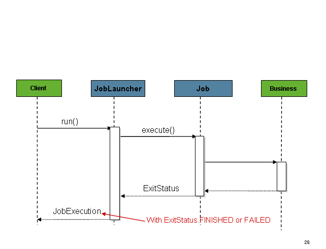

## Spring Batch——Job配置与运行

​		在上文中介绍了批处理的概念以及Spring Batch相关的使用场景，后续将会陆续说明在代码层面如何使用。

### 引入

​		Spring batch的引入非常简单，只需要引入Spring Framework、Datasource以及Spring Batch。在Spring Boot体系下只需引入`spring-boot-starter-batch` 即可。他已经涵盖了以上所有内容。


### Job配置

`Job`接口有多种多样的实现类，通常我们使用configuration类来构建获取一个`Job`：

```java
@Bean
public Job footballJob() {
    return this.jobBuilderFactory.get("footballJob") //Job名称
        .start(playerLoad()) //Job Step
        .next(gameLoad()) //Job Step
        .next(playerSummarization()) //Job Step
        .end()
        .build();
}
```

上面的代码定义了一个`Job`实例，并且在这个实例中包含了三个Step实例

#### 重启（启动）配置

​		批处理的一个核心问题是需要定义重启（启动）时的一些行为。当指定的`JobInstance` 被`JobExecution `执行时候即认为某个`Job`已经重启（启动）。理想状态下，所有的任务都应该可以从它们之前中断的位置启动，但是某些情况下这样做是无法实现的。开发人员可以关闭重启机制或认为每次启动都是新的`JobInstance `：

```java
@Bean
public Job footballJob() {
    return this.jobBuilderFactory.get("footballJob")
        .preventRestart() //防止重启
        ...
        .build();
}
```

#### 监听Job Execution

当任务执行完毕或开始执行时，需要执行一些处理工作。这个时候可以使用`JobExecutionListener`：

```java
public interface JobExecutionListener {
    void beforeJob(JobExecution jobExecution);
    void afterJob(JobExecution jobExecution);
}
```

添加方式：

```java
@Bean
public Job footballJob() {
    return this.jobBuilderFactory.get("footballJob")
        .listener(sampleListener()) 		
        //JobExecutionListener的实现类
        ...
        .build();
}
```

需要注意的是`afterJob`方法无论批处理任务成功还是失败都会被执行，所以增加以下判断：

```java
public void afterJob(JobExecution jobExecution){
    if( jobExecution.getStatus() == BatchStatus.COMPLETED ){
        //job success
    }
    else if(jobExecution.getStatus() == BatchStatus.FAILED){
        //job failure
    }
}
```

除了直接实现接口还可以用 @BeforeJob 和 @AfterJob 注解。

#### Java配置

​		在Spring Batch 2.2.0版本之后（Spring 3.0+）支持纯Java配置。其核心是`@EnableBatchProcessing `注解和两个构造器。`@EnableBatchProcessing`的作用类似于Spring中的其他@Enable*,使用`@EnableBatchProcessing`之后会提供一个基本的配置用于执行批处理任务。

​		对应的会有一系列`StepScope`实例被注入到Ioc容器中：`JobRepository`、`JobLauncher`、`JobRegistry`、`PlatformTransactionManager`、`JobBuilderFactory`以及`StepBuilderFactory`。

​		配置的核心接口是`BatchConfigurer`，默认情况下需要在容器中指定`DataSource`，该数据源用于JobRepository相关的表。开发的过程中可以使用自定义的`BatchConfigurer`实现来提供以上所有的Bean。通常情况下可以扩展重载`DefaultBatchConfigurer`类中的Getter方法用于实现部分自定义功能：

```java
@Bean
public BatchConfigurer batchConfigurer() {
    return new DefaultBatchConfigurer() {
        @Override
        public PlatformTransactionManager getTransactionManager() {
            return new MyTransactionManager();
        }
    };
}
```

使用了`@EnableBatchProcessing`之后开发人员可以使用以下的方法来配置一个Job：

```java
@Configuration
@EnableBatchProcessing
@Import(DataSourceConfiguration.class)
public class AppConfig {

    @Autowired
    private JobBuilderFactory jobs;

    @Autowired
    private StepBuilderFactory steps;

    @Bean
    public Job job(@Qualifier("step1") Step step1,@Qualifier("step2") Step step2) {
        return jobs.get("myJob").start(step1).next(step2).build();
    }

    @Bean
    protected Step step1(ItemReader<Person> reader,
                         ItemProcessor<Person, Person> processor,
                         ItemWriter<Person> writer) {
        return steps.get("step1")
            .<Person, Person> chunk(10)
            .reader(reader)
            .processor(processor)
            .writer(writer)
            .build();
    }

    @Bean
    protected Step step2(Tasklet tasklet) {
        return steps.get("step2")
            .tasklet(tasklet)
            .build();
    }
}
```


### JobRepository配置

​		一旦使用了`@EnableBatchProcessing` 注解，`JobRepository`即会被注入到IoCs容器中并自动使用容器中的`DataSource`。`JobRepository`用于处理批处理表的CURD，整个Spring Batch的运行都会使用到它。除了使用容器中默认的`DataSoruce`以及其他组件，还可以在`BatchConfigurer`中进行配置：

```java
@Override
protected JobRepository createJobRepository() throws Exception {
    JobRepositoryFactoryBean factory = new JobRepositoryFactoryBean();
    factory.setDataSource(dataSource);
    factory.setTransactionManager(transactionManager);
    factory.setIsolationLevelForCreate("ISOLATION_SERIALIZABLE");
    factory.setTablePrefix("BATCH_");
    factory.setMaxVarCharLength(1000);
    return factory.getObject();
}
```

在代码中可以看到，设置`JobRepository`需要`DataSource`和`TransactionManager`，如果没有指定将会使用容器中的默认配置。

#### JobRepository的事物配置

​		默认情况下框架为`JobRepository`提供了默认`PlatformTransactionManager`事物管理。它用于确保批处理执行过程中的元数据正确的写入到指定数据源中。如果缺乏事物，那么框架产生元数据就无法和整个处理过程完全契合。

​		如下图，在BatchConfigurer中的`setIsolationLevelForCreate`方法中可以指定事物的隔离等级：

```java
protected JobRepository createJobRepository() throws Exception {
    JobRepositoryFactoryBean factory = new JobRepositoryFactoryBean();
    factory.setDataSource(dataSource);
    factory.setTransactionManager(transactionManager);
    factory.setIsolationLevelForCreate("ISOLATION_REPEATABLE_READ");
    return factory.getObject();
}
```

`setIsolationLevelForCreate`方法支持2个值：`ISOLATION_SERIALIZABLE` 、`ISOLATION_REPEATABLE_READ` ，前者是默认配置，类似于`@Transactional(isolation = Isolation.SERIALIZABLE)`，表示查询和写入都是一次事物，会对事物进行严格的锁定，当事物完成提交后才能进行其他的读写操作，容易死锁。后者是读事物开放，写事物锁定。任何时候都可以快速的读取数据，但是写入事物有严格的事物机制。当一个事物挂起某些记录时，其他写操作必须排队。

#### 修改表名称

默认情况下，`JobRepository`管理的表都以*BATCH_*开头。需要时可以修改前缀：

```java
// This would reside in your BatchConfigurer implementation
@Override
protected JobRepository createJobRepository() throws Exception {
    JobRepositoryFactoryBean factory = new JobRepositoryFactoryBean();
    factory.setDataSource(dataSource);
    factory.setTransactionManager(transactionManager);
    factory.setTablePrefix("SYSTEM.TEST_"); //修改前缀
    return factory.getObject();
}
```

#### 内存级存储

​		Spring Batch支持将运行时的状态数据（元数据）仅保存在内存中。重载`JobRepository`不设置`DataSource` 即可：

```java
@Override
protected JobRepository createJobRepository() throws Exception {
    MapJobRepositoryFactoryBean factory = new MapJobRepositoryFactoryBean();
    factory.setTransactionManager(transactionManager);
    return factory.getObject();
}
```

需要注意的是，内存级存储无法满足分布式系统。

#### JobLauncher配置

启用了`@EnableBatchProcessing `之后`JobLauncher` 会自动注入到容器中以供使用。此外可以自行进行配置：

```java
@Override
protected JobLauncher createJobLauncher() throws Exception {
    SimpleJobLauncher jobLauncher = new SimpleJobLauncher();
    jobLauncher.setJobRepository(jobRepository);
    jobLauncher.afterPropertiesSet();
    return jobLauncher;
}
```

`JobLauncher` 唯一的必要依赖只有`JobRepository`。如下图，Job的执行通常是一个同步过程： 



可以通过修改TaskExecutor来指定Job的执行过程：

```java
@Bean
public JobLauncher jobLauncher() {
    SimpleJobLauncher jobLauncher = new SimpleJobLauncher();
    jobLauncher.setJobRepository(jobRepository());
    jobLauncher.setTaskExecutor(new SimpleAsyncTaskExecutor()); //转换为异步任务
    jobLauncher.afterPropertiesSet();
    return jobLauncher;
}
```

这样执行过程变为：


### 运行一个Job

以一个Http为例：

```java
@Controller
public class JobLauncherController {

    @Autowired
    JobLauncher jobLauncher;

    @Autowired
    Job job;

    @RequestMapping("/jobLauncher.html")
    public void handle() throws Exception{
        jobLauncher.run(job, new JobParameters());
    }
}
```

单单是配置好`Job`是肯定无法执行的，还需要对Step进行配置。后面会陆续介绍。