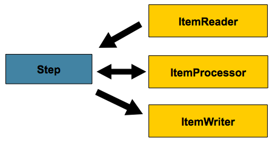
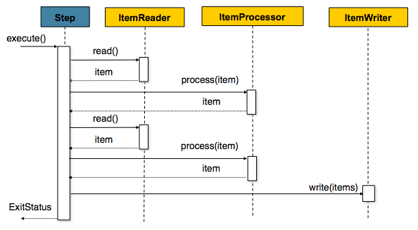
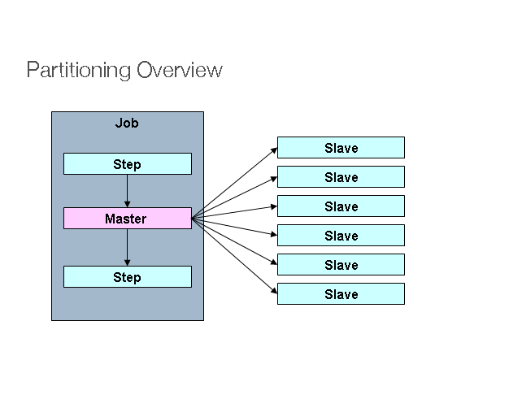
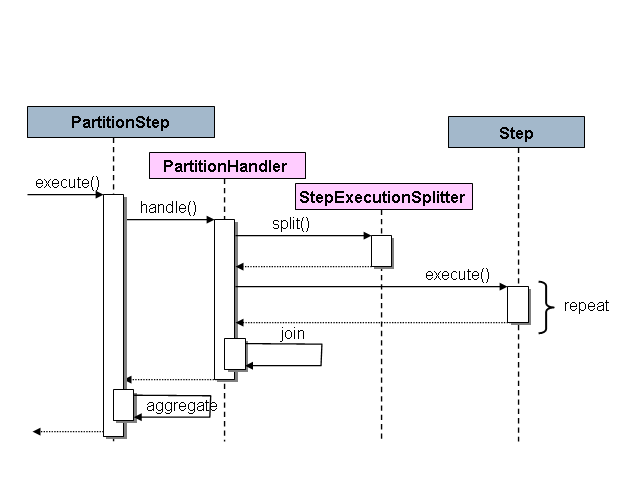

## Spring Batch——Step控制

​		批处理任务的主要业务逻辑都是在`Step`中去完成的。可以将`Job`理解为运行`Step`的框架，而`Step`理解为业务功能。


### Step配置

​		`Step`是`Job`中的工作单元，每一个`Step`涵盖了单行记录的处理闭环。下图是一个`Step`的简要结构：



​		一个`Step`通常涵盖三个部分：读数据（Reader）、处理数据（Processor）和写数据（Writer）。但是并不是所有的`Step` 都需要自身来完成数据的处理，比如存储过程等方式是通过外部功能来完成，因此Spring Batch提供了2种Step的处理方式：1）面向分片的`ChunkStep`，2）面向过程的`TaskletStep`。但是基本上大部分情况下都是使用面向分片的方式来解决问题。


### 面向分片的处理过程

​		在`Step`中数据是按记录（按行）处理的，但是每条记录处理完毕之后马上提交事物反而会导致IO的巨大压力。因此Spring Batch提供了数据处理的分片功能。设置了分片之后，一次工作会从Read开始，然后交由给Processor处理。处理完毕后会进行聚合，待聚合到一定的数量的数据之后一次性调用Write将数据提交到物理数据库。其过程大致为：



在Spring Batch中所谓的事物和数据事物的概念一样，就是一次性提交多少数据。如果在聚合数据期间出现任何错误，所有的这些数据都将不执行写入。


### 分区

Spring Batch也为Step的分区执行和远程执行提供了一个SPI(服务提供者接口)。在这种情况下,远端的执行程序只是一些简单的Step实例,配置和使用方式都和本机处理一样容易。下面是一幅实际的模型示意图:



在左侧执行的作业(Job)是串行的Steps,而中间的那一个Step被标记为 Master。图中的 Slave 都是一个Step的相同实例,对于作业来说,这些Slave的执行结果实际上等价于就是Master的结果。Slaves通常是远程服务,但也有可能是本地执行的其他线程。在此模式中,Master发送给Slave的消息不需要持久化(durable) ,也不要求保证交付: 对每个作业执行步骤来说,保存在 **JobRepository** 中的Spring Batch元信息将确保每个Slave都会且仅会被执行一次。

Spring Batch的SPI由Step的一个专门的实现( **PartitionStep**),以及需要由特定环境实现的两个策略接口组成。这两个策略接口分别是 **PartitionHandler** 和 **StepExecutionSplitter**,他们的角色如下面的序列图所示:此时在右边的Step就是“远程”Slave。




#### 分区处理器(PartitionHandler)

**PartitionHandler**组件知道远程网格环境的组织结构。 它可以发送**StepExecution**请求给远端Steps,采用某种具体的数据格式,例如DTO.它不需要知道如何分割输入数据,或者如何聚合多个步骤执行的结果。一般来说它可能也不需要了解弹性或故障转移,因为在许多情况下这些都是结构的特性,无论如何Spring Batch总是提供了独立于结构的可重启能力: 一个失败的作业总是会被重新启动,并且只会重新执行失败的步骤。

**PartitionHandler**接口可以有各种结构的实现类: 如简单RMI远程方法调用,EJB远程调用,自定义web服务、JMS、Java Spaces, 共享内存网格(如Terracotta或Coherence)、网格执行结构(如GridGain)。Spring Batch自身不包含任何专有网格或远程结构的实现。

但是 Spring Batch也提供了一个有用的**PartitionHandler**实现，在本地分开的线程中执行Steps,该实现类名为 **TaskExecutorPartitionHandler**,并且他是上面的XML配置中的默认处理器。还可以像下面这样明确地指定:

```xml
<step id="step1.master">
    <partition step="step1" handler="handler"/>
</step>
<bean class="org.spr...TaskExecutorPartitionHandler">
    <property name="taskExecutor" ref="taskExecutor"/>
    <property name="step" ref="step1" />
    <property name="gridSize" value="10" />
</bean>
```

**gridSize**决定要创建的独立的step执行的数量,所以它可以配置为**TaskExecutor**中线程池的大小,或者也可以设置得比可用的线程数稍大一点,在这种情况下,执行块变得更小一些。

**TaskExecutorPartitionHandler** 对于IO密集型步骤非常给力,比如要拷贝大量的文件,或复制文件系统到内容管理系统时。它还可用于远程执行的实现,通过为远程调用提供一个代理的步骤实现(例如使用Spring Remoting)，如下面代码注入到 Spring 容器当中使用

```java
@Bean
public PartitionHandler suyqrPartitionHandler(){
    // 分格，多线程处理
    TaskExecutorPartitionHandler handler = new TaskExecutorPartitionHandler();
    handler.setGridSize(10);
    handler.setStep(suyqrSlaveStep());
    handler.setTaskExecutor(taskExecutor);
    try {
        handler.afterPropertiesSet();
    } catch (Exception e) {
        e.printStackTrace();
    }
    return handler;
}
```

#### 分割器(Partitioner)

分割器有一个简单的职责: 仅为新的step实例生成执行环境(contexts),作为输入参数(这样重启时就不需要考虑)。 该接口只有一个方法:

```java
public interface Partitioner {
    Map<String, ExecutionContext> partition(int gridSize);
}
```

这个方法的返回值是一个Map对象,将每个Step执行分配的唯一名称(Map泛型中的 **String**),和与其相关的输入参数以**ExecutionContext** 的形式做一个映射。Step执行的名称( **Partitioner**接口返回的 **Map** 中的 key)在整个作业的执行过程中需要保持唯一,除此之外没有其他具体要求。简单说，实现 `Partitioner` 接口实现


### 面向对象配置Step

```java
@Bean
public Job sampleJob(JobRepository jobRepository, Step sampleStep) {
    return this.jobBuilderFactory.get("sampleJob")
    			.repository(jobRepository)
                .start(sampleStep)
                .build();
}

@Bean
public Step sampleStep(PlatformTransactionManager transactionManager) {
	return this.stepBuilderFactory.get("sampleStep")
				.transactionManager(transactionManager)
				.<String, String>chunk(10) //分片配置
				.reader(itemReader()) //reader配置
				.writer(itemWriter()) //write配置
				.build();
}
```

观察sampleStep方法：

1. reader: 使用ItemReader提供读数据的方法。
2. write：ItemWrite提供写数据的方法。
3. transactionManager：使用默认的 `PlatformTransactionManager` 对事物进行管理。当配置好事物之后Spring Batch会自动对事物进行管理，无需开发人员显示操作。
4. chunk：指定一次性数据提交的记录数，因为任务是基于Step分次处理的，当累计到chunk配置的次数则进行一次提交。提交的内容除了业务数据，还有批处理任务运行相关的元数据。

是否使用`ItemProcessor`是一个可选项。如果没有Processor可以将数据视为读取并直接写入。 


### 提交间隔

​		`Step`使用`PlatformTransactionManager`管理事物。每次事物提交的间隔根据`chunk`方法中配置的数据执行。如果设置为1，那么在每一条数据处理完之后都会调用`ItemWrite`进行提交。提交间隔设置太小，那么会浪费需要多不必要的资源，提交间隔设置的太长，会导致事物链太长占用空间，并且出现失败会导致大量数据回滚。因此设定一个合理的间隔是非常必要的，这需要根据实际业务情况、性能要求、以及数据安全程度来设定。如果没有明确的评估目标，设置为10~20较为合适。


### 配置Step重启

前文介绍了`Job`的重启，但是每次重启对`Step`也是有很大的影响的，因此需要特定的配置。

#### 限定重启次数

​		某些`Step`可能用于处理一些先决的任务，所以当Job再次重启时这`Step`就没必要再执行，可以通过设置startLimit来限定某个`Step`重启的次数。当设置为1时候表示仅仅运行一次，而出现重启时将不再执行：

```java
@Bean
public Step step1() {
	return this.stepBuilderFactory.get("step1")
				.<String, String>chunk(10)
				.reader(itemReader())
				.writer(itemWriter())
				.startLimit(1)
				.build();
}
```

#### 重启已经完成任务的Step

​		在单个`JobInstance`的上下文中，如果某个`Step`已经处理完毕（COMPLETED）那么在默认情况下重启之后这个`Step`并不会再执行。可以通过设置`allow-start-if-complete`为true告知框架每次重启该`Step`都要执行：

```java
@Bean
public Step step1() {
	return this.stepBuilderFactory.get("step1")
				.<String, String>chunk(10)
				.reader(itemReader())
				.writer(itemWriter())
				.allowStartIfComplete(true)
				.build();
}
```


### 配置略过逻辑

​		某些时候在任务处理单个记录时中出现失败并不应该停止任务，而应该跳过继续处理下一条数据。是否跳过需要根据业务来判定，因此框架提供了跳过机制交给开发人员使用。如何配置跳过机制：

```java
@Bean
public Step step1() {
	return this.stepBuilderFactory.get("step1")
				.<String, String>chunk(10)
				.reader(flatFileItemReader())
				.writer(itemWriter())
				.faultTolerant()
				.skipLimit(10)
				.skip(FlatFileParseException.class)
				.build();
}
```

代码的含义是当处理过程中抛出`FlatFileParseException`异常时就跳过该条记录的处理。`skip-limit`（skipLimit方法）配置的参数表示当跳过的次数超过数值时则会导致整个`Step`失败，从而停止继续运行。还可以通过反向配置的方式来忽略某些异常：

```java
@Bean
public Step step1() {
	return this.stepBuilderFactory.get("step1")
				.<String, String>chunk(10)
				.reader(flatFileItemReader())
				.writer(itemWriter())
				.faultTolerant()
				.skipLimit(10)
				.skip(Exception.class)
				.noSkip(FileNotFoundException.class)
				.build();
}
```

`skip`表示要当捕捉到*Exception*异常就跳过。但是*Exception*有很多继承类，此时可以使用`noSkip`方法指定某些异常不能跳过。


### 设置重试逻辑

当处理记录出个异常之后并不希望他立即跳过或者停止运行，而是希望可以多次尝试执行直到失败：

```java
@Bean
public Step step1() {
	return this.stepBuilderFactory.get("step1")
				.<String, String>chunk(2)
				.reader(itemReader())
				.writer(itemWriter())
				.faultTolerant()
				.retryLimit(3)
				.retry(DeadlockLoserDataAccessException.class)
				.build();
}
```

`retry(DeadlockLoserDataAccessException.class)`表示只有捕捉到该异常才会重试，`retryLimit(3)`表示最多重试3次，`faultTolerant()`表示启用对应的容错功能。


### Step 中的事务

#### 事物回滚控制

​		默认情况下，无论是设置了重试（retry）还是跳过（skip），只要从`Writer`抛出一个异常都会导致事物回滚。如果配置了skip机制，那么在`Reader`中抛出的异常不会导致回滚。有些从`Writer`抛出一个异常并不需要回滚数据，`noRollback`属性为`Step`提供了不必进行事物回滚的异常配置：

```java
@Bean
public Step step1() {
	return this.stepBuilderFactory.get("step1")
				.<String, String>chunk(2)
				.reader(itemReader())
				.writer(itemWriter())
				.faultTolerant()
        		//不必回滚的异常
				.noRollback(ValidationException.class)
				.build();
}
```


#### 事物数据读取的缓存

​		一次`Setp`分为`Reader`、`Processor` 和`Writer` 三个阶段，这些阶段统称为`Item`。默认情况下如果错误不是发生在Reader阶段，那么没必要再去重新读取一次数据。但是某些场景下需要Reader部分也需要重新执行，比如Reader是从一个JMS队列中消费消息，当发生回滚的时候消息也会在队列上重放，因此也要将Reader纳入到回滚的事物中，根据这个场景可以使用`readerIsTransactionalQueue` 来配置数据重读：

```java
@Bean
public Step step1() {
	return this.stepBuilderFactory.get("step1")
				.<String, String>chunk(2)
				.reader(itemReader())
				.writer(itemWriter())
				.readerIsTransactionalQueue() //数据重读
				.build();
}
```


#### 事物属性

事物的属性包括**隔离等级（isolation）**、**传播方式（propagation）以及过期时间（timeout）**。关于事物的控制详见[Spring Data Access](https://docs.spring.io/spring/docs/current/spring-framework-reference/data-access.html#transaction)的说明，下面是相关配置的方法：

```java
@Bean
public Step step1() {
	//配置事物属性
	DefaultTransactionAttribute attribute = new DefaultTransactionAttribute();
	attribute.setPropagationBehavior(Propagation.REQUIRED.value());
	attribute.setIsolationLevel(Isolation.DEFAULT.value());
	attribute.setTimeout(30);

	return this.stepBuilderFactory.get("step1")
				.<String, String>chunk(2)
				.reader(itemReader())
				.writer(itemWriter())
				.transactionAttribute(attribute) //设置事物属性
				.build();
}
```


### 向Step注册 ItemStream

​		`ItemStream`是用于每一个阶段（Reader、Processor、Writer）的”生命周期回调数据处理器“，后续的文章会详细介绍`ItemStream`。在4.×版本之后默认注入注册了通用的`ItemStream`。

有2种方式将`ItemStream`注册到`Step`中，一是使用`stream`方法：

```java
@Bean
public Step step1() {
	return this.stepBuilderFactory.get("step1")
				.<String, String>chunk(2)
				.reader(itemReader())
				.writer(compositeItemWriter())
				.stream(fileItemWriter1())
				.stream(fileItemWriter2())
				.build();
}
```

二是使用相关方法的代理：

```java
@Bean
public CompositeItemWriter compositeItemWriter() {
	List<ItemWriter> writers = new ArrayList<>(2);
	writers.add(fileItemWriter1());
	writers.add(fileItemWriter2());
	CompositeItemWriter itemWriter = new CompositeItemWriter();
	itemWriter.setDelegates(writers);
	return itemWriter;
}
```


### StepExecution拦截器

在`Step`执行的过程中会产生各种各样的事件，开发人员可以利用各种`Listener`接口对`Step`及`Item`进行监听。通常在创建一个Step的时候添加拦截器：

```java
@Bean
public Step step1() {
	return this.stepBuilderFactory.get("step1")
				.<String, String>chunk(10)
				.reader(reader())
				.writer(writer())
				.listener(chunkListener()) //添加拦截器
				.build();
}
```

Spring Batch提供了多个接口以满足不同事件的监听。

#### StepExecutionListener

`StepExecutionListener`可以看做一个通用的`Step`拦截器，他的作用是在Step开始之前和结束之后进行拦截处理：

```java
public interface StepExecutionListener extends StepListener {
    void beforeStep(StepExecution stepExecution); //Step执行之前
    ExitStatus afterStep(StepExecution stepExecution); //Step执行完毕之后
}
```

在结束的时候开发人员可以自己定义返回的`ExitStatus`，用于配合流程控制（见后文）实现对整个Step执行过程的控制。

#### ChunkListener

`ChunkListener`是在数据事物发生的两端被触发。`chunk`的配置决定了处理多少项记录才进行一次事物提交，`ChunkListener`的作用就是对一次事物开始之后或事物提交之后进行拦截：

```java
public interface ChunkListener extends StepListener {
    void beforeChunk(ChunkContext context); //事物开始之后，ItemReader调用之前
    void afterChunk(ChunkContext context); //事物提交之后
    void afterChunkError(ChunkContext context); //事物回滚之后
}
```

如果没有设定chunk也可以使用`ChunkListener`，它会被`TaskletStep`调用（`TaskletStep`见后文）。

#### ItemReadListener

该接口用于对`Reader`相关的事件进行监控：

```java
public interface ItemReadListener<T> extends StepListener {
    void beforeRead();
    void afterRead(T item);
    void onReadError(Exception ex);
}
```

`beforeRead`在每次`Reader`调用之前被调用，`afterRead`在每次`Reader`成功返回之后被调用，而`onReadError`会在出现异常之后被调用，可以将其用于记录异常日志。

#### ItemProcessListener

`ItemProcessListener`和`ItemReadListener`类似，是围绕着`ItemProcessor`进行处理的：

```java
public interface ItemProcessListener<T, S> extends StepListener {
    void beforeProcess(T item); //processor执行之前
    void afterProcess(T item, S result); //processor直线成功之后
    void onProcessError(T item, Exception e); //processor执行出现异常
}
```

#### ItemWriteListener

`ItemWriteListener`的功能和`ItemReadListener`、`ItemReadListener`类似，但是需要注意的是它接收和处理的数据对象是一个`List`。`List`的长度与chunk配置相关。

```java
public interface ItemWriteListener<S> extends StepListener {
    void beforeWrite(List<? extends S> items);
    void afterWrite(List<? extends S> items);
    void onWriteError(Exception exception, List<? extends S> items);
}
```

#### SkipListener

`ItemReadListener`、`ItemProcessListener`和`ItemWriteListener`都提供了错误拦截处理的机制，但是没有处理跳过（skip）的数据记录。因此框架提供了`SkipListener`来专门处理那么被跳过的记录：

```java
public interface SkipListener<T,S> extends StepListener {
    void onSkipInRead(Throwable t); //Read期间导致跳过的异常
    void onSkipInProcess(T item, Throwable t); //Process期间导致跳过的异常
    void onSkipInWrite(S item, Throwable t); //Write期间导致跳过的异常
}
```

`SkipListener`的价值是可以将那些未能成功处理的记录在某个位置保存下来，然后交给其他批处理进一步解决，或者人工来处理。Spring Batch保证以下2个特征：

1. 跳过的元素只会出现一次。
2. `SkipListener`始终在事物提交之前被调用，这样可以保证监听器使用的事物资源不会被业务事物影响。


### TaskletStep

​		面向分片（Chunk-oriented processing ）的过程并不是Step的唯一执行方式。比如用数据库的存储过程来处理数据，这个时候使用标准的Reader、Processor、Writer会很奇怪，针对这些情况框架提供了`TaskletStep`。		`TaskletStep`是一个非常简单的接口，仅有一个方法——`execute`。`TaskletStep`会反复的调用这个方法直到获取一个`RepeatStatus.FINISHED`返回或者抛出一个异常。所有的`Tasklet`调用都会包装在一个事物中。

注册一个`TaskletStep`非常简单，只要添加一个实现了`Tasklet`接口的类即可：

```java
@Bean
public Step step1() {
    return this.stepBuilderFactory.get("step1")
    			.tasklet(myTasklet()) //注入Tasklet的实现
    			.build();
}
```

`TaskletStep`还支持适配器处理等，详见[官网说明](https://docs.spring.io/spring-batch/4.2.x/reference/html/step.html#taskletStep)。


### 控制Step执行流程

#### 顺序执行

顺序执行通过`next`方法来标记：

```java
@Bean
public Job job() {
	return this.jobBuilderFactory.get("job")
				.start(stepA())
				.next(stepB()) //顺序执行
				.next(stepC())
				.build();
}
```

#### 条件执行

在顺序执行的过程中，在整个执行链条中有一个`Step`执行失败则整个`Job`就会停止。但是通过条件执行，可以指定各种情况下的执行分。为了实现更加复杂的控制，可以通过`Step`执行后的退出命名来定义条件分之。先看一个简单的代码：

```java
@Bean
public Job job() {
	return this.jobBuilderFactory.get("job")
				.start(stepA()) //启动时执行的step
				.on("*").to(stepB()) //默认跳转到stepB
        		//当返回的ExitStatus为"FAILED"时，执行。
				.from(stepA()).on("FAILED").to(stepC()) 
				.end()
				.build();
}
```

这里使用来表示默认处理，是一个通配符表示处理任意字符串，对应的还可以使用?表示匹配任意字符。在上文中介绍了Step的退出都会有`ExitStatus`，命名都来源于它。下面是一个更加全面的代码。

1. 配置拦截器处理ExitCode：

```java
public class SkipCheckingListener extends StepExecutionListenerSupport {
    public ExitStatus afterStep(StepExecution stepExecution) {
        String exitCode = stepExecution.getExitStatus().getExitCode();
        if (!exitCode.equals(ExitStatus.FAILED.getExitCode()) &&
             //当Skip的Item大于0时，则指定ExitStatus的内容
              stepExecution.getSkipCount() > 0) {
            return new ExitStatus("COMPLETED WITH SKIPS");
        } else {
            return null;
        }
    }
}
```

拦截器指示当有一个以上被跳过的记录时，返回的`ExitStatus`为"COMPLETED WITH SKIPS"。对应的控制流程：

```java
@Bean
public Job job() {
	return this.jobBuilderFactory.get("job")
			.start(step1()).on("FAILED").end() //执行失败直接退出
        	//有跳过元素执行 errorPrint1()
			.from(step1()).on("COMPLETED WITH SKIPS").to(errorPrint1()) 
			.from(step1()).on("*").to(step2()) //默认（成功）情况下执行 Step2
			.end()
			.build();
}
```

#### Step的停机退出机制

​		Spring Batch为`Job`提供了三种退出机制，这些机制为批处理的执行提供了丰富的控制方法。在介绍退出机制之前需要回顾一下 [数据批处理概念](https://www.chkui.com/article/spring/spring_batch_introduction)一文中关于`StepExecution`的内容。在`StepExecution`中有2个表示状态的值，一个名为`status`，另外一个名为`exitStatus`。前者也被称为`BatchStatus`。

​		前面以及介绍了`ExitStatus`的使用，他可以控制Step执行链条的条件执行过程。除此之外`BatchStatus`也会参与到过程的控制。

##### End退出

默认情况下（没有使用`end`、`fail`方法结束），`Job`要顺序执行直到退出，这个退出称为`end`。这个时候，`BatchStatus`=`COMPLETED`、`ExitStatus`=`COMPLETED`，表示成功执行。

除了`Step`链式处理自然退出，也可以显示调用`end`来退出系统。看下面的例子：

```java
@Bean
public Job job() {
	return this.jobBuilderFactory.get("job")
				.start(step1()) //启动
				.next(step2()) //顺序执行
				.on("FAILED").end()
				.from(step2()).on("*").to(step3()) //条件执行
				.end()
				.build();
}
```

上面的代码，`step1`到`step2`是顺序执行，当`step2`的`exitStatus`返回"FAILED"时则直接*End退出*。其他情况执行`Step3`。

##### Fail退出

除了`end`还可以使用`fail`退出，这个时候，`BatchStatus`=`FAILED`、`ExitStatus`=`EARLY TERMINATION`，表示执行失败。这个状态与`End`最大的区别是`Job`会尝试重启执行新的`JobExecution`。看下面代码的例子：

```java
@Bean
public Job job() {
	return this.jobBuilderFactory.get("job")
			.start(step1()) //执行step1
			.next(step2()).on("FAILED").fail() //step2的ExitStatus=FAILED 执行fail
			.from(step2()).on("*").to(step3()) //否则执行step3
			.end()
			.build();
}
```

##### 在指定的节点中断

Spring Batch还支持在指定的节点退出，退出后下次重启会从中断的点继续执行。中断的作用是某些批处理到某个步骤后需要人工干预，当干预完之后又接着处理：

```java
@Bean
public Job job() {
	return this.jobBuilderFactory.get("job")
	 		//如果step1的ExitStatus=COMPLETED则在step2中断
			.start(step1()).on("COMPLETED").stopAndRestart(step2())
			 //否则直接退出批处理
			.end()
			.build();
}
```

##### 程序化流程的分支

可以直接进行编码来控制`Step`之间的扭转，Spring Batch提供了`JobExecutionDecider`接口来协助分支管理：

```java
public class MyDecider implements JobExecutionDecider {
    public FlowExecutionStatus decide(JobExecution jobExecution, StepExecution stepExecution) {
        String status;
        if (someCondition()) {
            status = "FAILED";
        }
        else {
            status = "COMPLETED";
        }
        return new FlowExecutionStatus(status);
    }
}
```

接着将`MyDecider`作为过滤器添加到配置过程中：

```java
@Bean
public Job job() {
	return this.jobBuilderFactory.get("job")
			.start(step1())
			.next(decider()).on("FAILED").to(step2())
			.from(decider()).on("COMPLETED").to(step3())
			.end()
			.build();
}
```


#### 流程分裂

在线性处理过程中，流程都是一个接着一个执行的。但是为了满足某些特殊的需要，Spring Batch提供了执行的过程分裂并行`Step`的方法。参看下面的`Job`配置：

```java
@Bean
public Job job() {
	Flow flow1 = new FlowBuilder<SimpleFlow>("flow1")
			.start(step1())
			.next(step2())
			.build();//并行流程1
	Flow flow2 = new FlowBuilder<SimpleFlow>("flow2")
			.start(step3())
			.build();//并行流程2

	return this.jobBuilderFactory.get("job")
				.start(flow1)
				.split(new SimpleAsyncTaskExecutor()) //创建一个异步执行任务
				.add(flow2)
				.next(step4()) //2个分支执行完毕之后再执行step4。
				.end()
				.build();
}
```

这里表示flow1和flow2会并行执行，待2者执行成功后执行step4。


#### 数据绑定

在`Job`或`Step`的任何位置，都可以获取到统一配置的数据。比如使用标准的Spring Framework方式：

```java
@Bean
public FlatFileItemReader flatFileItemReader(@Value("${input.file.name}") String name) {
	return new FlatFileItemReaderBuilder<Foo>()
			.name("flatFileItemReader")
			.resource(new FileSystemResource(name))
			...
}
```

当我们通过配置文件（application.properties中 `input.file.name=filepath`）或者jvm参数（`-Dinput.file.name=filepath`）指定某些数据时，都可以通过这种方式获取到对应的配置参数。

此外，也可以从`JobParameters`从获取到`Job`运行的上下文参数：

```java
@StepScope
@Bean
public FlatFileItemReader flatFileItemReader(@Value("#{jobParameters['input.file.name']}") String name) {
	return new FlatFileItemReaderBuilder<Foo>()
			.name("flatFileItemReader")
			.resource(new FileSystemResource(name))
			...
}
```

无论是`JobExecution`还是`StepExecution`，其中的内容都可以通过这种方式去获取参数，例如：

```java
@StepScope
@Bean
public FlatFileItemReader flatFileItemReader(@Value("#{jobExecutionContext['input.file.name']}") String name) {
	return new FlatFileItemReaderBuilder<Foo>()
			.name("flatFileItemReader")
			.resource(new FileSystemResource(name))
			...
}
```

或者

```java
@StepScope
@Bean
public FlatFileItemReader flatFileItemReader(@Value("#{stepExecutionContext['input.file.name']}") String name) {
	return new FlatFileItemReaderBuilder<Foo>()
			.name("flatFileItemReader")
			.resource(new FileSystemResource(name))
			...
}
```

##### Step Scope

注意看上面的代码例子，都有一个`@StepScope`注解。这是为了进行后期绑定进行的标识。因为在Spring的IoCs容器进行初始化的阶段并没有任何的`*Execution`在执行，进而也不存在任何`*ExecutionContext`，所以这个时候根本无法注入标记的数据。所以需要使用注解显式的告诉容器直到`Step`执行的阶段才初始化这个`@Bean`。

##### Job Scope

Job Scope的概念和 Step Scope类似，都是用于标识在到了某个执行时间段再添加和注入Bean。`@JobScope`用于告知框架知道`JobInstance`存在时候才初始化对应的`@Bean`：

```java
@JobScope
@Bean
// 初始化获取 jobParameters中的参数
public FlatFileItemReader flatFileItemReader(@Value("#{jobParameters[input]}") String name) {
	return new FlatFileItemReaderBuilder<Foo>()
			.name("flatFileItemReader")
			.resource(new FileSystemResource(name))
			...
}
```

```java
@JobScope
@Bean
// 初始化获取jobExecutionContext中的参数
public FlatFileItemReader flatFileItemReader(@Value("#{jobExecutionContext中的参数['input.name']}") String name) {
	return new FlatFileItemReaderBuilder<Foo>()
			.name("flatFileItemReader")
			.resource(new FileSystemResource(name))
			...
}
```

