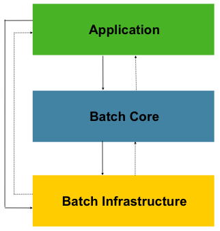

# Spring Batch Java 批处理框架 


## Spring Batch 概念


### 批处理的核心场景

- 从某个位置读取大量的记录，位置可以是数据库、文件或者外部推送队列（MQ）。
- 根据业务需要实时处理读取的数据。
- 将处理后的数据写入某个位置，可以第一条一样，可以是数据库、文件或者推送到队列。


### Spring Batch能解决的批处理场景

​		Spring Batch为批处理提供了一个轻量化的解决方案，它根据批处理的需要迭代处理各种记录，提供事物功能。但是Spring Batch仅仅适用于"脱机"场景，在处理的过程中不能和外部进行任何交互，也不允许有任何输入。


### Spring Batch的目标

- 开发人员仅关注业务逻辑，底层框架的交互交由Spring Batch去处理。
- 能够清晰分离业务与框架，框架已经限定了批处理的业务切入点，业务开发只需关注这些切入点（Read、Process、Write）。
- 提供开箱即用的通用接口。
- 快速轻松的融入Spring 框架，基于Spring Framework能够快速扩展各种功能。
- 所有现有核心服务都应易于更换或扩展，而不会对基础架构层产生任何影响。


### Spring Batch结构



​		如上图，通常情况下一个独立的JVM程序就是仅仅用于处理批处理，而不要和其他功能重叠。 在最后一层基础设置（Infrastructure）部分主要分为3个部分。`JobLauncher`、`Job`以及`Step`。每一个`Step`又细分为`ItemReader`、`ItemProcessor`、`ItemWirte`。使用*Spring Batch*主要就是知道每一个基础设置负责的内容，然后在对应的设施中实现对应的业务。


### Spring Batch 批处理原则与建议

当我们构建一个批处理的过程时，必须注意以下原则：

1. 通常情况下，批处理的过程对系统和架构的设计要够要求比较高，因此尽可能的使用通用架构来处理批量数据处理，降低问题发生的可能性。Spring Batch是一个是一个轻量级的框架，适用于处理一些灵活并没有到海量的数据。
2. 批处理应该尽可能的简单，尽量避免在单个批处理中去执行过于复杂的任务。我们可以将任务分成多个批处理或者多个步骤去实现。
3. 保证数据处理和物理数据紧密相连。笼统的说就是我们在处理数据的过程中有很多步骤，在某些步骤执行完时应该就写入数据，而不是等所有都处理完。
4. 尽可能减少系统资源的使用、尤其是耗费大量资源的IO以及跨服务器引用，尽量分配好数据处理的批量。
5. 定期分析系统的IO使用情况、SQL语句的执行情况等，尽可能的减少不必要的IO操作。优化的原则有：
   1. 尽量在一次事物中对同一数据进行读取或写缓存。
   2. 一次事物中，尽可能在开始就读取所有需要使用的数据。
   3. 优化索引，观察SQL的执行情况，尽量使用主键索引，尽量避免全表扫描或过多的索引扫描。
6. 不要在批处理中对相同的数据执行2次相同的操作。
7. 对于批处理程序而言应该在批处理启动之前就分配足够的内存，以免处理的过程中去重新申请新的内存页。
8. 对数据的完整性应该从最差的角度来考虑，每一步的处理都应该建立完备的数据校验。
9. 对于数据的总量我们应该有一个和数据记录在数据结构的某个字段上。
10. 所有的批处理系统都需要进行压力测试。
11.  如果整个批处理的过程是基于文件系统，在处理的过程中请切记完成文件的备份以及文件内容的校验。


### 批处理的通用策略

和软件开发的设计模式一样，批处理也有各种各样的现成模式可供参考。当一个开发（设计）人员开始执行批处理任务时，应该将业务逻辑拆分为一下的步骤或者板块分批执行：

1. 数据转换：某个（某些）批处理的外部数据可能来自不同的外部系统或者外部提供者，这些数据的结构千差万别。在统一进行批量数据处理之前需要对这些数据进行转换，合并为一个统一的结构。因此在数据开始真正的执行业务处理之前，可以先搭建批处理任务将这些数据统一转换。
2. 数据校验：批处理是对大量数据进行处理，并且数据的来源千差万别，所以批处理的输入数据需要对数据的完整性性进行校验（比如校验字段数据是否缺失）。另外批处理输出的数据也需要进行合适的校验（例如处理了100条数据，校验100条数据是否校验成功）
3. 提取数据：批处理的工作是逐条从数据库或目标文件读取记录（records），提取时可以通过一些规则从数据源中进行数据筛选。
4. 数据实时更新处理：根据业务要求，对实时数据进行处理。某些时候一行数据记录的处理需要绑定在一个事物之下。
5. 输出记录到标准的文档格式：数据处理完成之后需要根据格式写入到对应的外部数据系统中。

以上五个步骤是一个标准的数据批处理过程，Spring batch框架为业务实现提供了以上几个功能入口。


### 数据额外处理

某些情况需要实现对数据进行额外处理，在进入批处理之前通过其他方式将数据进行处理。主要内容有：

1. 排序：由于批处理是以独立的行数据（record）进行处理的，在处理的时候并不知道记录前后关系。因此如果需要对整体数据进行排序，最好事先使用其他方式完成。
2. 分割：数据拆分也建议使用独立的任务来完成。理由类似排序，因为批处理的过程都是以行记录为基本处理单位的，无法再对分割之后的数据进行扩展处理。
3. 合并：理由如上。


### 常规数据源

批处理的数据源通常包括：

1. 数据库驱动链接（链接到数据库）对数据进行逐条提取。
2. 文件驱动链接，对文件数据进行提取
3. 消息驱动链接，从MQ、kafka等消息系统提取数据。


### 典型的处理过程

1. 在业务停止的窗口期进行批数据处理，例如银行对账、清结算都是在12点日切到黎明之间。简称为离线处理。
2. 在线或并发批处理，但是需要对实际业务或用户的响应进行考量。
3. 并行处理多种不同的批处理作业。
4. 分区处理：将相同的数据分为不同的区块，然后按照相同的步骤分为许多独立的批处理任务对不同的区块进行处理。
5. 以上处理过程进行组合。

在执行2,3点批处理时需要注意事物隔离等级。


### Spring Batch批处理的核心概念

下图是批处理的核心流程图。 


​		Spring Batch同样按照批处理的标准实现了各个层级的组件。并且在框架级别保证数据的完整性和事物性。

​		如图所示，在一个标准的批处理任务中组要涵盖的核心概念有`JobLauncher`、`Job`、`Step`，一个`Job`可以涵盖多个`Step`，一个`Job`对应一个启动的`JobLauncher`。一个`Step`中分为`ItemReader`、`ItemProcessor`、`ItemWriter`，根据字面意思它们分别对应数据提取、数据处理和数据写入。此外`JobLauncher`、`Job`、`Step`也称之为批处理的元数据（Metadata），它们会被存储到`JobRepository`中。

#### Job

简单的说`Job`是封装一个批处理过程的实体，与其他的Spring项目类似，`Job`可以通过XML或Java类配置，称职为”Job Configuration“.如下图`Job`是单个批处理的最顶层。


为了便于理解，可以建立的理解为`Job`就是每一步（`Step`）实例的容器。他结合了多个`Step`，为它们提供统一的服务同时也为`Step`提供个性化的服务，比如步骤重启。通常情况下`Job的配置包含以下内容`：

- Job的名称
- 定义和排序`Step`执行实例。
- 标记每个`Step`是否可以重启。

Spring Batch为Job接口提供了默认的实现——`SimpleJob`类，在类中实现了一些标准的批处理方法。下面的代码展示了如可申明一个`Job` (在Config类中)。

```java
@Bean
public Job footballJob() {
    return this.jobBuilderFactory
        //get中命名了Job的名称
        .get("footballJob") 
        //playerLoad、gameLoad、playerSummarization都是Step
        .start(playerLoad())  
        .next(gameLoad())
        .next(playerSummarization())
        .end()
        .build();
}
```

#### JobInstance

`JobInstance`是指批处理作业运行的实例。例如一个批处理必须在每天执行一次，系统在2019年5月1日执行了一次我们称之为2019-05-01的实例，类似的还会有2019-05-02、2019-05-03实例。在特定的运行实践中，一个`Job`只有一个`JobInstance`以及对应的`JobParameters `，但是可以有多个`JobExecution` 。（`JobParameters` 、`JobExecution` 见后文）。同一个`JobInstance` 具有相同的上下文（`ExecutionContext` 内容见后文）。

#### JobParameters

前面讨论了`JobInstance` 与`Job` 的区别，但是具体的区别内容都是通过`JobParameters `体现的。一个`JobParameters` 对象中包含了一系列Job运行相关的参数，这些参数可以用于参考或者用于实际的业务使用。对应的关系如下图：


当我们执行2个不同的`JobInstance`时`JobParameters`中的属性都会有差异。可以简单的认为一个`JobInstance`的标识就是 `Job` + `JobParameters` 。

#### JobExecution

​		`JobExecution` 可以理解为单次运行`Job`的容器。一次`JobInstance`执行的结果可能是成功、也可能是失败。但是对于Spring Batch框架而言，只有返回运行成功才会视为完成一次批处理。例如2019-05-01执行了一次`JobInstance`，但是执行的过程失败，因此第二次还会有一个“相同的”的 `JobInstance` 被执行。

​		`Job` 可以定义批处理如何执行，`JobInstance` 纯粹的就是一个处理对象，把所有的内容、对象组织在一起，主要是为了当面临问题时定义正确的重启参数。而`JobExecution`是运行时的“容器”，记录动态运行时的各种属性和上线文，主要有一下内容：

| 属性              | 说明                                                         |
| ----------------- | ------------------------------------------------------------ |
| status            | 状态类名为BatchStatus，它指示了执行的状态。在执行的过程中状态为BatchStatus#STARTED，失败：BatchStatus#FAILED，完成：BatchStatus#COMPLETED |
| startTime         | java.util.Date对象，标记批处理任务启动的系统时间，批处理任务未启动数据为空 |
| endTime           | java.util.Date对象，结束时间无论是否成功都包含该数据，如未处理完为空 |
| exitStatus        | ExitStatus类，记录运行结果。                                 |
| createTime        | java.util.Date,  JobExecution的创建时间，某些使用execution已经创建但是并未开始运行。 |
| lastUpdate        | java.util.Date，最后一次更新时间                             |
| executionContext  | 批处理任务执行的所有用户数据                                 |
| failureExceptions | 记录在执行Job时的异常，对于排查问题非常有用                  |

对应的每次执行的结果会在元数据库中体现为：

BATCH_JOB_INSTANCE：

| JOB_INST_ID | JOB_NAME    |
| ----------- | ----------- |
| 1           | EndOfDayJob |

BATCH_JOB_EXECUTION_PARAMS：

| JOB_EXECUTION_ID | TYPE_CD | KEY_NAME      | DATE_VAL   | IDENTIFYING |
| ---------------- | ------- | ------------- | ---------- | ----------- |
| 1                | DATE    | schedule.Date | 2019-01-01 | TRUE        |

BATCH_JOB_EXECUTION：

| JOB_EXEC_ID | JOB_INST_ID | START_TIME       | END_TIME         | STATUS |
| ----------- | ----------- | ---------------- | ---------------- | ------ |
| 1           | 1           | 2019-01-01 21:00 | 2017-01-01 21:30 | FAILED |

​		

​		当某个`Job`批处理任务失败之后会在对应的数据库表中路对应的状态。假设1月1号执行的任务失败，技术团队花费了大量的时间解决这个问题到了第二天21才继续执行这个任务。

BATCH_JOB_INSTANCE：

| JOB_INST_ID | JOB_NAME    |
| ----------- | ----------- |
| 1           | EndOfDayJob |
| 2           | EndOfDayJob |

BATCH_JOB_EXECUTION_PARAMS：

| JOB_EXECUTION_ID | TYPE_CD | KEY_NAME      | DATE_VAL   | IDENTIFYING |
| ---------------- | ------- | ------------- | ---------- | ----------- |
| 1                | DATE    | schedule.Date | 2019-01-01 | TRUE        |
| 2                | DATE    | schedule.Date | 2019-01-01 | TRUE        |
| 3                | DATE    | schedule.Date | 2019-01-02 | TRUE        |

BATCH_JOB_EXECUTION：

| JOB_EXEC_ID | JOB_INST_ID | START_TIME       | END_TIME         | STATUS    |
| ----------- | ----------- | ---------------- | ---------------- | --------- |
| 1           | 1           | 2019-01-01 21:00 | 2017-01-01 21:30 | FAILED    |
| 2           | 1           | 2019-01-02 21:00 | 2017-01-02 21:30 | COMPLETED |
| 3           | 2           | 2019-01-02 21:31 | 2017-01-02 22:29 | COMPLETED |

从数据上看好似`JobInstance`是一个接一个顺序执行的，但是对于Spring Batch并没有进行任何控制。不同的`JobInstance`很有可能是同时在运行（相同的`JobInstance`同时运行会抛出`JobExecutionAlreadyRunningException`异常）。

#### Step

​		`Step`是批处理重复运行的最小单元，它按照顺序定义了一次执行的必要过程。因此每个`Job`可以视作由一个或多个多个`Step`组成。一个`Step`包含了所有所有进行批处理的必要信息，这些信息的内容是由开发人员决定的并没有统一的标准。一个`Step`可以很简单，也可以很复杂。他可以是复杂业务的组合，也有可能仅仅用于迁移数据。与`JobExecution`的概念类似，`Step`也有特定的`StepExecution`，关系结构如下：


#### StepExecution

​		`StepExecution`表示单次执行Step的容器，每次`Step`执行时都会有一个新的`StepExecution`被创建。与`JobExecution`不同的是，当某个`Step`执行失败后并不会再次尝试重新执行该`Step`。`StepExecution`包含以下属性：

| 属性             | 说明                                                         |
| ---------------- | ------------------------------------------------------------ |
| status           | 状态类名为BatchStatus，它指示了执行的状态。在执行的过程中状态为BatchStatus#STARTED，失败：BatchStatus#FAILED，完成：BatchStatus#COMPLETED |
| startTime        | java.util.Date对象，标记StepExecution启动的系统时间，未启动数据为空 |
| endTime          | java.util.Date对象，结束时间，无论是否成功都包含该数据，如未处理完为空 |
| exitStatus       | ExitStatus类，记录运行结果。                                 |
| createTime       | java.util.Date,JobExecution的创建时间，某些使用execution已经创建但是并未开始运行。 |
| lastUpdate       | java.util.Date，最后一次更新时间                             |
| executionContext | 批处理任务执行的所有用户数据                                 |
| readCount        | 成功读取数据的次数                                           |
| wirteCount       | 成功写入数据的次数                                           |
| commitCount      | 成功提交数据的次数                                           |
| rollbackCount    | 回归数据的次数，有业务代码触发                               |
| readSkipCount    | 当读数据发生错误时跳过处理的次数                             |
| processSkipCount | 当处理过程发生错误，跳过处理的次数                           |
| filterCount      | 被过滤规则拦截未处理的次数                                   |
| writeSkipCount   | 写数据失败，跳过处理的次数                                   |


#### ExecutionContext

前文已经多次提到`ExecutionContext`。可以简单的认为`ExecutionContext`提供了一个*Key/Value*机制，在`StepExecution`和`JobExecution`对象的任何位置都可以获取到`ExecutionContext`中的任何数据。最有价值的作用是记录数据的执行位置，以便发生重启时候从对应的位置继续执行：

```java
executionContext.putLong(getKey(LINES_READ_COUNT), reader.getPosition())
```

比如在任务中有一个名为“loadData”的`Step`，他的作用是从文件中读取数据写入到数据库，当第一次执行失败后，数据库中有如下数据：

BATCH_JOB_INSTANCE：

| JOB_INST_ID | JOB_NAME    |
| :---------- | :---------- |
| 1           | EndOfDayJob |

BATCH_JOB_EXECUTION_PARAMS：

| JOB_INST_ID | TYPE_CD | KEY_NAME      | DATE_VAL   |
| :---------- | :------ | :------------ | :--------- |
| 1           | DATE    | schedule.Date | 2019-01-01 |

ATCH_JOB_EXECUTION：

| JOB_EXEC_ID | JOB_INST_ID | START_TIME       | END_TIME         | STATUS |
| :---------- | :---------- | :--------------- | :--------------- | :----- |
| 1           | 1           | 2017-01-01 21:00 | 2017-01-01 21:30 | FAILED |

BATCH_STEP_EXECUTION：

| STEP_EXEC_ID | JOB_EXEC_ID | STEP_NAME | START_TIME       | END_TIME         | STATUS |
| :----------- | :---------- | :-------- | :--------------- | :--------------- | :----- |
| 1            | 1           | loadData  | 2017-01-01 21:00 | 2017-01-01 21:30 |        |

BATCH_STEP_EXECUTION_CONTEXT： 

|STEP_EXEC_ID|SHORT_CONTEXT|
|:---|:---|
|1|{piece.count=40321}|

​		在上面的例子中，`Step` 运行30分钟处理了40321个“pieces”，我们姑且认为“pieces”表示行间的行数（实际就是每个Step完成循环处理的个数）。这个值会在每个`commit`之前被更新记录在`ExecutionContext`中（更新需要用到`StepListener`后文会详细说明）。当我们再次重启这个`Job`时并记录在*BATCH_STEP_EXECUTION_CONTEXT*中的数据会加载到`ExecutionContext`中,这样当我们继续执行批处理任务时可以从上一次中断的位置继续处理。例如下面的代码在`ItemReader`中检查上次执行的结果，并从中断的位置继续执行：

```java
if (executionContext.containsKey(getKey(LINES_READ_COUNT))) {
    log.debug("Initializing for restart. Restart data is: " + executionContext);

    long lineCount = executionContext.getLong(getKey(LINES_READ_COUNT));

    LineReader reader = getReader();

    Object record = "";
    while (reader.getPosition() < lineCount && record != null) {
        record = readLine();
    }
}
```

`ExecutionContext`是根据`JobInstance`进行管理的，因此只要是相同的实例都会具备相同的ExecutionContext（无论是否停止）。此外通过以下方法都可以获得一个`ExecutionContext`：

```java
ExecutionContext ecStep = stepExecution.getExecutionContext();
ExecutionContext ecJob = jobExecution.getExecutionContext();
```

但是这2个`ExecutionContext`并不相同，前者是在一个`Step`中每次`Commit`数据之间共享，后者是在`Step`与`Step`之间共享。

#### JobRepository

​		`JobRepository`是所有前面介绍的对象实例的持久化机制。他为`JobLauncher`、`Job`、`Step`的实现提供了CRUD操作。当一个`Job`第一次被启动时，一个`JobExecution`会从数据源中获取到，同时在执行的过程中`StepExecution`、`JobExecution`的实现都会记录到数据源中。挡在程序启动时使用`@EnableBatchProcessing`注解，`JobRepository`会进行自动化配置。

#### JobLauncher

`JobLauncher`为`Job`的启动运行提供了一个边界的入口，在启动`Job`的同时还可以定制`JobParameters`：

```java
public interface JobLauncher {
	public JobExecution run(Job job, JobParameters jobParameters)
				throws JobExecutionAlreadyRunningException, JobRestartException,JobInstanceAlreadyCompleteException,JobParametersInvalidException;
}
```


## [Spring Batch——Step控制](SpringBatchStep.md)


## [Spring Batch——Job配置与运行](./SpringBatchJob.md)


## Spring Batch——Item概念及使用代码

在上文中介绍一个标准的批处理分为 `Job` 和 `Step` 。本文将结合代码介绍在`Step`中`Reader`、`Processor`、`Writer`的实际使用。


### Reader

`Reader`是指从各种各样的外部输入中获取数据，框架为获取各种类型的文件已经预定义了常规的`Reader`实现类。`Reader`通过`ItemReader`接口实现：

```java
public interface ItemReader<T> {
    T read() throws Exception, UnexpectedInputException, ParseException, NonTransientResourceException;
}
```

`read`方法的作用就是读取一条数据，数据以泛型T的实体结构返回，**当read返回null时表示所有数据读取完毕**。返回的数据可以是任何结构，比如文件中的一行字符串，数据库的一行数据，或者xml文件中的一系列元素，只要是一个Java对象即可。


### Writer

`Writer`通过`ItemWriter`接口实现：

```java
public interface ItemWriter<T> {
    void write(List<? extends T> items) throws Exception;
}
```

`Writer`是`Reader`的反向操作，是将数据写入到特定的数据源中。在上文已经介绍`Writer`是根据`chunk`属性设定的值按列表进行操作的，所以传入的是一个`List`结构。`chunk`用于表示批处理的事物分片，因此需要注意的是，在`writer`方法中进行完整数据写入事物操作。例如向数据库写入`List`中的数据，在写入完成之后再提交事物。


### 读写的组合模式

无论是读还是写，有时会需要从多个不同的来源获取文件，或者写入到不同的数据源，或者是需要在读和写之间处理一些业务。可以使用组合模式来实现这个目的：

```java
public class CompositeItemWriter<T> implements ItemWriter<T> {
    ItemWriter<T> itemWriter;
    public CompositeItemWriter(ItemWriter<T> itemWriter) {
        this.itemWriter = itemWriter;
    }

    public void write(List<? extends T> items) throws Exception {
        //Add business logic here
       itemWriter.write(items);
    }

    public void setDelegate(ItemWriter<T> itemWriter){
        this.itemWriter = itemWriter;
    }
}
```


### Processor

除了使用组合模式，直接使用`Processor`是一种更优雅的方法。`Processor`是`Step`中的可选项，但是批处理大部分时候都需要对数据进行处理，因此框架提供了`ItemProcessor`接口来满足 `Processor` 过程：

```java
public interface ItemProcessor<I, O> {
    O process(I item) throws Exception;
}
```

`Processor`的结构非常简单也是否易于理解。传入一个类型`<I>`，然后由`Processor`处理成为`<O>`。

#### Processor链

在一个Step中可以使用多个`Processor`来按照顺序处理业务，此时同样可以使用`CompositeItem`模式来实现：

```java
@Bean
public CompositeItemProcessor compositeProcessor() {
    //创建 CompositeItemProcessor
    CompositeItemProcessor<Foo,Foobar> compositeProcessor = new CompositeItemProcessor<Foo,Foobar>();
    List itemProcessors = new ArrayList();
    //添加第一个 Processor
    itemProcessors.add(new FooTransformer());
    //添加第二个 Processor
    itemProcessors.add(new BarTransformer());
    //添加链表
    compositeProcessor.setDelegates(itemProcessors);
    return processor;
}
```

#### 过滤记录

​		在`Reader`读取数据的过程中，并不是所有的数据都可以使用，此时`Processor`还可以用于过滤非必要的数据，同时不会影响`Step`的处理过程。只要`ItemProcesspr`的实现类在`procss`方法中返回`null`即表示改行数据被过滤掉了。


### ItemStream

​		在上文中已经提到了`ItemStream`。Spring Batch的每一步都是无状态的，进而`Reader`和`Writer`也是无状态的，这种方式能够很好的隔离每行数据的处理，也能将容错的范围收窄到可以空子的范围。但是这并不意味着整个批处理的过程中并不需要控制状态。例如从数据库持续读入或写入数据，每次`Reader`和`Writer`都单独去申请数据源的链接、维护数据源的状态（打开、关闭等）。因此框架提供了`ItemStream`接口来完善这些操作：

```java
public interface ItemStream {
    void open(ExecutionContext executionContext) throws ItemStreamException;
    void update(ExecutionContext executionContext) throws ItemStreamException;
    void close() throws ItemStreamException;
}
```


### 持久化数据

​		在使用Spring Batch之前需要初始化他的元数据存储（Meta-Data Schema）,也就是要将需要用到的表导入到对应的数据库中。当然，Spring Batch支持不使用任何持久化数据库，仅仅将数据放到内存中，不设置`DataSource`即可。

#### 初始化序列

Spring Batch相关的工作需要使用序列`SEQUENCE`：

```sql
CREATE SEQUENCE BATCH_STEP_EXECUTION_SEQ;
CREATE SEQUENCE BATCH_JOB_EXECUTION_SEQ;
CREATE SEQUENCE BATCH_JOB_SEQ;
```

有些数据库不支持`SEQUENCE`，可以通过表代理，比如在MySql（InnoDB数据库）中：

```sql
CREATE TABLE BATCH_STEP_EXECUTION_SEQ (ID BIGINT NOT NULL);
INSERT INTO BATCH_STEP_EXECUTION_SEQ values(0);
CREATE TABLE BATCH_JOB_EXECUTION_SEQ (ID BIGINT NOT NULL);
INSERT INTO BATCH_JOB_EXECUTION_SEQ values(0);
CREATE TABLE BATCH_JOB_SEQ (ID BIGINT NOT NULL);
INSERT INTO BATCH_JOB_SEQ values(0);
```

#### 关于Version字段

某些表中都有`Version`字段。因为Spring的更新策略是乐观锁，因此在进行数据更新之后都会对表的`Version`字段进行+1处理。在内存与数据库交互的过程中，会使用采用*getVersion*、*increaseVersion（+1）*、*updateDataAndVersion*的过程，如果在`update`的时候发现Version不是预计的数值（+1），则会抛出`OptimisticLockingFailureException`的异常。当同一个`Job`在进群中不同服务上执行时，需要注意这个问题。

#### BATCH_JOB_INSTANCE

`BATCH_JOB_INSTANCE`用于记录JobInstance，在[数据批处理概念](https://www.chkui.com/article/spring/spring_batch_introduction)中介绍了他的工作方式，其结构为：

```sql
CREATE TABLE BATCH_JOB_INSTANCE  (
  JOB_INSTANCE_ID BIGINT  PRIMARY KEY ,
  VERSION BIGINT,
  JOB_NAME VARCHAR(100) NOT NULL ,
  JOB_KEY VARCHAR(2500)
);
```

| 字段            | 说明                                                         |
| --------------- | ------------------------------------------------------------ |
| JOB_INSTANCE_ID | 主键，主键与单个JobInstance相关。当获取到某个JobInstance实例后，通过getId方法可以获取到此数据 |
| VERSION         |                                                              |
| JOB_NAME        | Job的名称，用于标记运行的Job，在创建Job时候指定              |
| JOB_KEY         | JobParameters的序列化数值。在数据批处理概念中介绍了一个JobInstance相当于Job+JobParameters。他用于标记同一个Job不同的实例 |

#### BATCH_JOB_EXECUTION_PARAMS

`BATCH_JOB_EXECUTION_PARAMS`对应的是`JobParameters`对象。其核心功能是存储*Key-Value*结构的各种状态数值。字段中`IDENTIFYING=true`用于标记那些运行过程中必须的数据（可以理解是框架需要用到的数据），为了存储*key-value*结构该表一个列数据格式：

```sql
CREATE TABLE BATCH_JOB_EXECUTION_PARAMS  (
	JOB_EXECUTION_ID BIGINT NOT NULL ,
	TYPE_CD VARCHAR(6) NOT NULL ,
	KEY_NAME VARCHAR(100) NOT NULL ,
	STRING_VAL VARCHAR(250) ,
	DATE_VAL DATETIME DEFAULT NULL ,
	LONG_VAL BIGINT ,
	DOUBLE_VAL DOUBLE PRECISION ,
	IDENTIFYING CHAR(1) NOT NULL ,
	constraint JOB_EXEC_PARAMS_FK foreign key (JOB_EXECUTION_ID)
	references BATCH_JOB_EXECUTION(JOB_EXECUTION_ID)
);
```

| 字段             | 说明                                                         |
| ---------------- | ------------------------------------------------------------ |
| JOB_EXECUTION_ID | 与BATCH_JOB_EXECUTION表关联的外键，详见数据批处理概念中Job、JobInstance、JobExecute的关系 |
| TYPE_CD          | 用于标记数据的对象类型，例如 string、date、long、double，非空 |
| KEY_NAME         | key的值                                                      |
| STRING_VAL       | string类型的数值                                             |
| DATE_VAL         | date类型的数值                                               |
| LONG_VAL         | long类型的数值                                               |
| DOUBLE_VAL       | double类型的数值                                             |
| IDENTIFYING      | 标记这对key-valuse是否来自于JobInstace自身                   |

#### BATCH_JOB_EXECUTION

关联`JobExecution`，每当运行一个`Job`都会产生一个新的`JobExecution`，对应的在表中都会新增一行数据。

```sql
CREATE TABLE BATCH_JOB_EXECUTION  (
  JOB_EXECUTION_ID BIGINT  PRIMARY KEY ,
  VERSION BIGINT,
  JOB_INSTANCE_ID BIGINT NOT NULL,
  CREATE_TIME TIMESTAMP NOT NULL,
  START_TIME TIMESTAMP DEFAULT NULL,
  END_TIME TIMESTAMP DEFAULT NULL,
  STATUS VARCHAR(10),
  EXIT_CODE VARCHAR(20),
  EXIT_MESSAGE VARCHAR(2500),
  LAST_UPDATED TIMESTAMP,
  JOB_CONFIGURATION_LOCATION VARCHAR(2500) NULL,
  constraint JOB_INSTANCE_EXECUTION_FK foreign key (JOB_INSTANCE_ID)
  references BATCH_JOB_INSTANCE(JOB_INSTANCE_ID)
) ;
```

| 字段             | 说明                                                         |
| :--------------- | :----------------------------------------------------------- |
| JOB_EXECUTION_ID | JobExecution的主键，JobExecution::getId方法可以获取到该值    |
| VERSION          |                                                              |
| JOB_INSTANCE_ID  | 关联到JobInstace的外键，详见数据批处理概念中Job、JobInstance、JobExecute的关系 |
| CREATE_TIME      | 创建时间戳                                                   |
| START_TIME       | 开始时间戳                                                   |
| END_TIME         | 结束时间戳，无论成功或失败都会更新这一项数据。如果某行数据该值为空表示运行期间出现错误，并且框架无法更新该值 |
| STATUS           | JobExecute的运行状态:COMPLETED、STARTED或者其他状态。此数值对应Java中BatchStatus枚举值 |
| EXIT_CODE        | JobExecute执行完毕之后的退出返回值                           |
| EXIT_MESSAGE     | JobExecute退出的详细内容，如果是异常退出可能会包括异常堆栈的内容 |
| LAST_UPDATED     | 最后一次更新的时间戳                                         |

#### BATCH_STEP_EXECUTION

该表对应的是`StepExecution`，其结构和`BATCH_JOB_EXECUTION`基本相似，只是对应的对象是`Step`，增加了与之相对的一些字段数值：

```javascript
CREATE TABLE BATCH_STEP_EXECUTION  (
  STEP_EXECUTION_ID BIGINT  PRIMARY KEY ,
  VERSION BIGINT NOT NULL,
  STEP_NAME VARCHAR(100) NOT NULL,
  JOB_EXECUTION_ID BIGINT NOT NULL,
  START_TIME TIMESTAMP NOT NULL ,
  END_TIME TIMESTAMP DEFAULT NULL,
  STATUS VARCHAR(10),
  COMMIT_COUNT BIGINT ,
  READ_COUNT BIGINT ,
  FILTER_COUNT BIGINT ,
  WRITE_COUNT BIGINT ,
  READ_SKIP_COUNT BIGINT ,
  WRITE_SKIP_COUNT BIGINT ,
  PROCESS_SKIP_COUNT BIGINT ,
  ROLLBACK_COUNT BIGINT ,
  EXIT_CODE VARCHAR(20) ,
  EXIT_MESSAGE VARCHAR(2500) ,
  LAST_UPDATED TIMESTAMP,
  constraint JOB_EXECUTION_STEP_FK foreign key (JOB_EXECUTION_ID)
  references BATCH_JOB_EXECUTION(JOB_EXECUTION_ID)
) ;
```

未填入内容部分见`BATCH_JOB_EXECUTION`说明。

| 字段               | 说明                                                         |
| :----------------- | :----------------------------------------------------------- |
| STEP_EXECUTION_ID  | StepExecute对应的主键                                        |
| VERSION            |                                                              |
| STEP_NAME          | Step名称                                                     |
| JOB_EXECUTION_ID   | 关联到BATCH_JOB_EXECUTION表的外键，标记该StepExecute所属的JobExecute |
| START_TIME         |                                                              |
| END_TIME           |                                                              |
| STATUS             |                                                              |
| COMMIT_COUNT       | 执行过程中，事物提交的次数，该值与数据的规模以及chunk的设置有关 |
| READ_COUNT         | 读取数据的次数                                               |
| FILTER_COUNT       | Processor中过滤记录的次数                                    |
| WRITE_COUNT        | 吸入数据的次数                                               |
| READ_SKIP_COUNT    | 读数据的跳过次数                                             |
| WRITE_SKIP_COUNT   | 写数据的跳过次数                                             |
| PROCESS_SKIP_COUNT | Processor跳过的次数                                          |
| ROLLBACK_COUNT     | 回滚的次数                                                   |
| EXIT_CODE          |                                                              |
| EXIT_MESSAGE       |                                                              |
| LAST_UPDATED       |                                                              |

#### BATCH_JOB_EXECUTION_CONTEXT

该表会记录所有与`Job`相关的`ExecutionContext`信息。每个`ExecutionContext`都对应一个`JobExecution`，在运行的过程中它包含了所有`Job`范畴的状态数据，这些数据在执行失败后对于后续处理有中重大意义。

```javascript
CREATE TABLE BATCH_JOB_EXECUTION_CONTEXT  (
  JOB_EXECUTION_ID BIGINT PRIMARY KEY,
  SHORT_CONTEXT VARCHAR(2500) NOT NULL,
  SERIALIZED_CONTEXT CLOB,
  constraint JOB_EXEC_CTX_FK foreign key (JOB_EXECUTION_ID)
  references BATCH_JOB_EXECUTION(JOB_EXECUTION_ID)
) ;
```

| 字段               | 说明                                                         |
| :----------------- | :----------------------------------------------------------- |
| JOB_EXECUTION_ID   | 关联到JobExecution的外键，建立JobExecution和ExecutionContext的关系。 |
| SHORT_CONTEXT      | 标记SERIALIZED_CONTEXT的版本号                               |
| SERIALIZED_CONTEXT | 序列化的ExecutionContext                                     |

#### BATCH_STEP_EXECUTION_CONTEXT

`Step`中`ExecutionContext`相关的数据表，结构与`BATCH_JOB_EXECUTION_CONTEXT`完全一样。

#### 表索引建议

上面的所有建表语句都没有提供索引，但是并不代表索引没有价值。当感觉到SQL语句的执行有效率问题时候，可以增加索引。

索引带来的价值取决于SQL查询的频率以及关联关系，下面是Spring Batch框架在运行过程中会用到的一些查询条件语句，用于参考优化索引：

| 表                      | Where条件                              | 执行频率           |
| :---------------------- | :------------------------------------- | :----------------- |
| BATCH_JOB_INSTANCE      | JOB_NAME = ? and JOB_KEY = ?           | 每次Job启动执时    |
| BATCH_JOB_EXECUTION     | JOB_INSTANCE_ID = ?                    | 每次Job重启时      |
| BATCH_EXECUTION_CONTEXT | EXECUTION_ID = ? and KEY_NAME = ?      | 视chunk的大小而定  |
| BATCH_STEP_EXECUTION    | VERSION = ?                            | 视chunk的大小而定  |
| BATCH_STEP_EXECUTION    | STEP_NAME = ? and JOB_EXECUTION_ID = ? | 每一个Step执行之前 |


## Spring Batch——文件读写

在上文中[Job](https://www.chkui.com/article/spring/spring_batch_job)、[Step](https://www.chkui.com/article/spring/spring_batch_step)都是属于框架级别的的功能，大部分时候都是提供一些配置选项给开发人员使用，而[Item](https://www.chkui.com/article/spring/spring_batch_item_and_code_case)中的`Reader`、`Processor`和`Writer`是属于业务级别的，它开放了一些业务切入的接口。 但是文件的读写过程中有很多通用一致的功能Spring Batch为这些相同的功能提供了一致性实现类。


### 扁平结构文件

**扁平结构文件**（也称为矩阵结构文件，后文简称为文件）是最常见的一种文件类型。他通常以一行表示一条记录，字段数据之间用某种方式分割。与标准的格式数据（xml、json等）主要差别在于他没有结构性描述方案（SXD、JSON-SCHEME），进而没有结构性分割规范。因此在读写此类文件之前需要先设定好字段的分割方法。

文件的字段数据分割方式通常有两种：**使用分隔符**或**固定字段长度**。前者通常使用逗号（`，`）之类的符号对字段数据进行划分，后者的每一列字段数据长度是固定的。 框架为文件的读取提供了`FieldSet`用于将文件结构中的信息映射到一个对象。`FieldSet`的作用是将文件的数据与类的`field`进行绑定（field是Java中常见的概念，不清楚的可以了解Java反射）。


### 数据读取

Spring Batch为文件读取提供了`FlatFileItemReader`类，它为文件中的数据的读取和转换提供了基本功能。在`FlatFileItemReader`中有2个主要的功能接口，一是`Resource`、二是`LineMapper`。 `Resource`用于外部文件获取，详情请查看[Spring核心——资源管理](https://www.chkui.com/article/spring/spring_core_resources_management)部分的内容，下面是一个例子：

```java
Resource resource = new FileSystemResource("resources/trades.csv"); 
```

在复杂的生产环境中，文件通常由中心化、或者流程式的基础框架来管理（比如EAI）。因此文件往往需要使用FTP等方式从其他位置获取。如何迁移文件已经超出了Spring Batch框架的范围，在Spring的体系中可以参考`Spring Integration`项目。

下面是`FlatFileItemReader`的属性，每一个属性都提供了Setter方法。

| 属性名                | 参数类型              | 说明                                                         |
| :-------------------- | :-------------------- | :----------------------------------------------------------- |
| comments              | String[]              | 指定文件中的注释前缀，用于过滤注释内容行                     |
| encoding              | String                | 指定文件的编码方式，默认为Charset.defaultCharset()           |
| lineMapper            | LineMapper            | 利用LineMapper接口将一行字符串转换为对象                     |
| linesToSkip           | int                   | 跳过文件开始位置的行数，用于跳过一些字段的描述行             |
| recordSeparatorPolicy | RecordSeparatorPolicy | 用于判断数据是否结束                                         |
| resource              | Resource              | 指定外部资源文件位置                                         |
| skippedLinesCallback  | LineCallbackHandler   | 当配置linesToSkip，每执行一次跳过都会被回调一次，会传入跳过的行数据内容 |

每个属性都为文件的解析提供了某方面的功能，下面是结构的说明。

#### LineMapper

这个接口的作用是将字符串转换为对象：

```java
public interface LineMapper { 
    T mapLine(String line, int lineNumber) throws Exception; 
}
```

接口的基本处理逻辑是聚合类（`FlatFileItemReader`）传递一行字符串以及行号给`LineMapper::mapLine`，方法处理后返回一个映射的对象。

#### LineTokenizer

这个接口的作用是将一行数据转换为一个`FieldSet`结构。对于Spring Batch而言，扁平结构文件的到Java实体的映射都通过`FieldSet`来控制，因此读写文件的过程需要完成字符串到`FieldSet`的转换：

```java
public interface LineTokenizer { 
    FieldSet tokenize(String line); 
}
```

这个接口的含义是：传递一行字符串数据，然后获取一个`FieldSet`。

框架为`LineTokenizer`提供三个实现类：

- `DelimitedLineTokenizer`：利用分隔符将数据转换为`FieldSet`。最常见的分隔符是逗号`,`，类提供了分隔符的配置和解析方法。
- `FixedLengthTokenizer`：根据字段的长度来解析出`FieldSet`结构。必须为记录定义字段宽度。
- `PatternMatchingCompositeLineTokenizer`：使用一个匹配机制来动态决定使用哪个`LineTokenizer`。

#### FieldSetMapper

该接口是将`FieldSet`转换为对象：

```java
public interface FieldSetMapper { 
    T mapFieldSet(FieldSet fieldSet) throws BindException; 
}
```

`FieldSetMapper`通常和`LineTokenizer`联合在一起使用：*String->FieldSet->Object*。

#### DefaultLineMapper

`DefaultLineMapper`是`LineMapper`的实现，他实现了从文件到Java实体的映射：

```java
public class DefaultLineMapper implements LineMapper<>, InitializingBean {
	private LineTokenizer tokenizer;
	private FieldSetMapper fieldSetMapper;
	public T mapLine(String line, int lineNumber) throws Exception {
		return fieldSetMapper.mapFieldSet(tokenizer.tokenize(line));
	}
	public void setLineTokenizer(LineTokenizer tokenizer) {
		this.tokenizer = tokenizer;
	}
	public void setFieldSetMapper(FieldSetMapper fieldSetMapper) {
		this.fieldSetMapper = fieldSetMapper;
	}
}
```

在解析文件时数据是按行解析的：

1. 传入一行字符串。
2. `LineTokenizer`将字符串解析为`FieldSet`结构。
3. `FieldSetMapper`继续解析为一个Java实体对象返回给调用者。

`DefaultLineMapper`是框架提供的默认实现类，看似非常简单，但是利用组合模式可以扩展出很多功能。

#### 数据自动映射

在转换过程中如果将`FieldSet`的`names`属性与目标类的`field`绑定在一起，那么可以直接使用反射实现数据转换，为此框架提供了`BeanWrapperFieldSetMapper`来实现。

```java
DefaultLineMapper<WeatherEntity> lineMapper = new DefaultLineMapper<>(); //创建LineMapper

DelimitedLineTokenizer tokenizer = new DelimitedLineTokenizer(); //创建LineTokenizer
tokenizer.setNames(new String[] { "siteId", "month", "type", "value", "ext" }); //设置Field名称

 //创建FieldSetMapper
BeanWrapperFieldSetMapper<WeatherEntity> wrapperMapper 
	= new BeanWrapperFieldSetMapper<>();
 //设置实体，实体的field名称必须和tokenizer.names一致。
wrapperMapper.setTargetType(WeatherEntity.class);

// 组合lineMapper
lineMapper.setLineTokenizer(tokenizer);
lineMapper.setFieldSetMapper(wrapperMapper);
```

#### 文件读取总结

上面提到了各种接口和实现，实际上都是围绕着`FlatFileItemReader`的属性在介绍，虽然内容很多但是实际上就以下几点：

-  首先要定位文件，Spring Batch提供了`Resource`相关的定位方法。 
-  其次是将文件中的行字符串数据转换为对象，`LineMapper`的功能就是完成这个功能。 
-  框架为`LineMapper`提供了`DefaultLineMapper`作为默认实现方法，在`DefaultLineMapper`中需要组合使用`LineTokenizer`和`FieldSetMapper`。前者将字符串转为为一个`Field`，后者将`Field`转换为目标对象。 
-  `LineTokenizer`有3个实现类可供使用、`FieldSetMapper`有一个默认实现类`BeanWrapperFieldSetMapper`。

#### 文件读取可执行源码

可执行的源码在下列地址的*items*子工程中：

- Gitee：https://gitee.com/chkui-com/spring-batch-sample
- Github：https://github.com/chkui/spring-batch-sample

运行之前需要配置[数据库](https://cloud.tencent.com/solution/database?from=10680)链接，参看源码库中的README.md。

文件读取的主要逻辑在`org.chenkui.spring.batch.sample.items.FlatFileReader`类：

```java
public class FlatFileReader {
    // FeildSet的字段名，设置字段名之后可以直接使用名字作为索引获取数据。也可以使用索引位置来获取数据
    public final static String[] Tokenizer = new String[] { "siteId", "month", "type", "value", "ext" };
    private boolean userWrapper = false;

    @Bean
    //定义FieldSetMapper用于FieldSet->WeatherEntity
    public FieldSetMapper<WeatherEntity> fieldSetMapper() {
        return new FieldSetMapper<WeatherEntity>() {
            @Override
            public WeatherEntity mapFieldSet(FieldSet fieldSet) throws BindException {
                if (null == fieldSet) {
                    // fieldSet不存在则跳过该行处理
                    return null; 
                } else {
                    WeatherEntity observe = new WeatherEntity();
                    observe.setSiteId(fieldSet.readRawString("siteId"));
                    //Setter
                    return observe;
                }
            }
        };
    }

    @Bean
    // 配置 Reader
    public ItemReader<WeatherEntity> flatFileReader(
                           @Qualifier("fieldSetMapper") FieldSetMapper<WeatherEntity> fieldSetMapper) {
        FlatFileItemReader<WeatherEntity> reader = new FlatFileItemReader<>();
         // 读取资源文件
        reader.setResource(new FileSystemResource("src/main/resources/data.csv"));
         // 初始化 LineMapper实现类
        DefaultLineMapper<WeatherEntity> lineMapper = new DefaultLineMapper<>();
         // 创建LineTokenizer接口实现
        DelimitedLineTokenizer tokenizer = new DelimitedLineTokenizer();

        // 设定每个字段的名称，如果不设置需要使用索引获取值
        tokenizer.setNames(Tokenizer); 
         // 设置tokenizer工具
        lineMapper.setLineTokenizer(tokenizer);

        //使用 BeanWrapperFieldSetMapper 使用反射直接转换
        if (userWrapper) { 
            BeanWrapperFieldSetMapper<WeatherEntity> wrapperMapper = new BeanWrapperFieldSetMapper<>();
            wrapperMapper.setTargetType(WeatherEntity.class);
            fieldSetMapper = wrapperMapper;
        }

        lineMapper.setFieldSetMapper(fieldSetMapper);
        reader.setLineMapper(lineMapper);
         // 跳过的初始行，用于过滤字段行
        reader.setLinesToSkip(1);
        reader.open(new ExecutionContext());
        return reader;
    }
}
```

#### 按字段长度格读取文件

除了按照分隔符，有些文件可以字段数据的占位长度来提取数据。按照前面介绍的过程，实际上只要修改LineTokenizer接口即可，框架提供了`FixedLengthTokenizer`类：

```java
@Bean
public FixedLengthTokenizer fixedLengthTokenizer() {
    FixedLengthTokenizer tokenizer = new FixedLengthTokenizer();

    tokenizer.setNames("ISIN", "Quantity", "Price", "Customer");
    //Range用于设定数据的长度。
    tokenizer.setColumns(new Range(1-12),
                        new Range(13-15),
                        new Range(16-20),
                        new Range(21-29));
	return tokenizer;
}
```


### 写入扁平结构文件

将数据写入到文件与读取的过程正好相反：将对象转换为字符串。

#### LineAggregator

与`LineMapper`相对应的是`LineAggregator`，他的功能是将实体转换为字符串：

```javascript
public interface LineAggregator<T> {
    public String aggregate(T item);
}
```

#### PassThroughLineAggregator

框架为`LineAggregator`接口提供了一个非常简单的实现类——`PassThroughLineAggregator`，其唯一实现就是使用对象的`toString`方法：

```java
public class PassThroughLineAggregator<T> implements LineAggregator<T> {
    public String aggregate(T item) {
        return item.toString();
    }
}
```

#### DelimitedLineAggregator

`LineAggregator`的另外一个实现类是`DelimitedLineAggregator`。与`PassThroughLineAggregator`简单直接使用`toString`方法不同的是，`DelimitedLineAggregator`需要一个转换接口`FieldExtractor`：

```java
DelimitedLineAggregator<CustomerCredit> lineAggregator = new DelimitedLineAggregator<>();
lineAggregator.setDelimiter(",");
lineAggregator.setFieldExtractor(fieldExtractor);
```

#### FieldExtractor

`FieldExtractor`用于实体类到`collection`结构的转换。它可以和`LineTokenizer`进行类比，前者是将实体类转换为扁平结构的数据，后者是将`String`转换为一个`FieldSet`结构。

```java
public interface FieldExtractor<T> {
    Object[] extract(T item);
}
```

框架为`FieldExtractor`接口提供了一个基于反射的实现类`BeanWrapperFieldExtractor`，其过程就是将实体对象转换为列表：

```java
BeanWrapperFieldExtractor<CustomerCredit> fieldExtractor = new BeanWrapperFieldExtractor<>();
fieldExtractor.setNames(new String[] {"field1", "field2"});
```

`setName`方法用于指定要转换的`field`列表。

#### 输出文件处理

​		文件读取的逻辑非常简单：文件存在打开文件并写入数据，当文件不存在抛出异常。但是写入文件明显不能这么简单粗暴。新建一个`JobInstance`时最直观的操作是：存在同名文件就抛出异常，不存在则创建文件并写入数据。但是这样做显然有很大的问题，当批处理过程中出现问题需要`restart`，此时并不会从头开始处理所有的数据，而是要求文件存在并接着继续写入。为了确保这个过程 `FlatFileItemWriter`默认会在新 `JobInstance`运行时删除已有文件，而运行重启时继续在文件末尾写入。 `FlatFileItemWriter`可以使用 `shouldDeleteIfExists`、 `appendAllowed`、 `shouldDeleteIfEmpty`来有针对性的控制文件。

#### 文件写入可执源码

文件写入主要代码在`org.chenkui.spring.batch.sample.items.FlatFileWriter`：

```java
public class FlatFileWriter {

    private boolean useBuilder = true;

    @Bean
    public ItemWriter<MaxTemperatureEntiry> flatFileWriter() {
        BeanWrapperFieldExtractor<MaxTemperatureEntiry> fieldExtractor = new BeanWrapperFieldExtractor<>();
        fieldExtractor.setNames(new String[] { "siteId", "date", "temperature" }); //设置映射field
        fieldExtractor.afterPropertiesSet(); //参数检查

        DelimitedLineAggregator<MaxTemperatureEntiry> lineAggregator = new DelimitedLineAggregator<>();
        lineAggregator.setDelimiter(","); //设置输出分隔符
        lineAggregator.setFieldExtractor(fieldExtractor); //设置FieldExtractor处理器

        FlatFileItemWriter<MaxTemperatureEntiry> fileWriter = new FlatFileItemWriter<>();
        fileWriter.setLineAggregator(lineAggregator);
        fileWriter.setResource(new FileSystemResource("src/main/resources/out-data.csv")); //设置输出文件位置
        fileWriter.setName("outpufData");

        if (useBuilder) {//使用builder方式创建
            fileWriter = new FlatFileItemWriterBuilder<MaxTemperatureEntiry>().name("outpufData")
                .resource(new FileSystemResource("src/main/resources/out-data.csv")).lineAggregator(lineAggregator)
                .build();
        }
        return fileWriter;
    }
}
```

文件的写入过程与读取过程完全对称相反：先用`FieldExtractor`将对象转换为一个`collection`结构（列表），然后用`lineAggregator`将`collection`转化为带分隔符的字符串。


### 代码说明

-  代码中的测试数据来自数据分析交流项目[bi-process-example](https://github.com/chkui/bi-process-example)，是NOAA的2015年全球天气监控数据。为了便于源码存储进行了大量的删减，原始数据有百万条，如有需要使用下列方式下载： 	curl -O ftp://ftp.ncdc.noaa.gov/pub/data/ghcn/daily/by_year/2015.csv.gz #数据文件 	curl -O ftp://ftp.ncdc.noaa.gov/pub/data/ghcn/daily/ghcnd-stations.txt # 文件结构及类型说明 
-  代码实现了读取文件、处理文件、写入文件的整个过程。处理文件的过程是只获取监控的最高温度信息（`Type=TMAX`），其他都过滤。 
-  本案例的代码使用`org.chenkui.spring.batch.sample.flatfile.FlatFileItemApplication::main`方法运行，使用的是Command Runner的方式执行（运行方式的说明见[Item概念及使用代码](https://www.chkui.com/article/spring/spring_batch_item_and_code_case)的*命令行方式运行*、*Java内嵌运行*）。


## Spring Batch——数据库批数据读写

本文将接着前面的内容说明数据库如何进行批处理读写。

### 数据读取

数据库是绝大部分系统要用到的数据存储工具，因此针对数据库执行批量数据处理任务也是很常见的需求。数据的批量处理与常规业务开发不同，如果一次性读取百万条，对于任何系统而言肯定都是不可取的。为了解决这个问题Spring Batch提供了2套数据读取方案：

- 基于游标读取数据
- 基于分页读取数据


### 游标读取数据

对于有经验[大数据](https://cloud.tencent.com/solution/bigdata?from=10680)工程师而言数据库游标的操作应该是非常熟悉的，因为这是从数据库读取*数据流*标准方法，而且在Java中也封装了`ResultSet`这种面向游标操作的数据结构。

`ResultSet`一直都会指向*结果集*中的某一行数据，使用`next`方法可以让游标跳转到下一行数据。Spring Batch同样使用这个特性来控制数据的读取：

1. 在初始化时打开游标。
2. 每一次调用`ItemReader::read`方法就从`ResultSet`获取一行数据并执行`next`。
3. 返回可用于数据处理的映射结构（map、dict）。

在一切都执行完毕之后，框架会使用回调过程调用`ResultSet::close`来关闭游标。由于所有的业务过程都绑定在一个事物之上，所以知道到`Step`执行完毕或异常退出调用执行`close`。下图展示了数据读取的过程：


SQL语句的查询结果称为*数据集*（对于大部分数据库而言，其SQL执行结果会产生临时的表空间索引来存放数据集）。游标开始会停滞在ID=2的位置，一次`ItemReader`执行完毕后会产生对应的实体`FOO2`，然后游标下移直到最后的ID=6。最后关闭游标。

#### JdbcCursorItemReader

`JdbcCursorItemReader`是使用游标读取数据集的`ItemReader`实现类之一。它使用`JdbcTemplate`中的`DataSource`控制`ResultSet`,其过程是将`ResultSet`的每行数据转换为所需要的实体类。

`JdbcCursorItemReader`的执行过程有三步：

1. 通过`DataSource`创建`JdbcTemplate`。
2. 设定数据集的SQL语句。
3. 创建`ResultSet`到实体类的映射。 大致如下：

```java
//随风溜达的向日葵 chkui.com
JdbcCursorItemReader itemReader = new JdbcCursorItemReader();
itemReader.setDataSource(dataSource);
itemReader.setSql("SELECT ID, NAME, CREDIT from CUSTOMER");
itemReader.setRowMapper(new CustomerCreditRowMapper());
```

除了上面的代码，`JdbcCursorItemReader`还有其他属性：

| 属性名称                       | 说明                                                         |
| :----------------------------- | :----------------------------------------------------------- |
| ignoreWarnings                 | 标记当执行SQL语句出现警告时，是输出日志还是抛出异常，默认为true——输出日志 |
| fetchSize                      | 预通知JDBC驱动全量数据的个数                                 |
| maxRows                        | 设置ResultSet从数据库中一次读取记录的上限                    |
| queryTimeout                   | 设置执行SQL语句的等待超时时间，单位秒。当超过这个时间会抛出DataAccessException |
| verifyCursorPosition           | 对游标位置进行校验。由于在RowMapper::mapRow方法中ResultSet是直接暴露给使用者的，因此有可能在业务代码层面调用了ResultSet::next方法。将这个属性设置为true,在框架中会有一个位置计数器与ResultSet保持一致，当执行完Reader后位置不一致会抛出异常。 |
| saveState                      | 标记读取的状态是否被存放到ExecutionContext中。默认为true     |
| driverSupportsAbsolute         | 告诉框架是指直接使用ResultSet::absolute方法来指定游标位置，使用这个属性需要数据库驱动支持。建议在支持absolute特性的数据库上开启这个特性，能够明显的提升性能。默认为false |
| setUseSharedExtendedConnection | 标记读取数据的游标是否与Step其他过程绑定成同一个事物。默认为false,表示读取数据的游标是单独建立连接的，具有自身独立的事物。如果设定为true需要用ExtendedConnectionDataSourceProxy包装DataSource用于管理事物过程。此时游标的创建标记为'READ_ONLY'、'HOLD_CURSORS_OVER_COMMIT'。需要注意的是该属性需要数据库支持3.0以上的JDBC驱动。 |

执行`JdbcCursorItemReader`的代码在`org.chenkui.spring.batch.sample.items.JdbcReader`。启动位置是`org.chenkui.spring.batch.sample.database.cursor.JdbcCurosrApplication`。

在运行代码之前请先在数据库中执行以下DDL语句，并添加部分测试数据。

```sql
CREATE TABLE `tmp_test_weather` (
  `id` int(10) unsigned NOT NULL AUTO_INCREMENT COMMENT '主键',
  `siteid` varchar(64) NOT NULL COMMENT '业务主键',
  `month` varchar(64) NOT NULL COMMENT '日期',
  `type` varchar(64) NOT NULL COMMENT '气象类型',
  `value` int(11) NOT NULL COMMENT '值',
  `ext` varchar(255) DEFAULT NULL COMMENT '扩展数据',
  PRIMARY KEY (`id`)
) ;
```

运行代码：

```java
//随风溜达的向日葵 chkui.com
public class JdbcReader {

    @Bean
    public RowMapper<WeatherEntity> weatherEntityRowMapper() {

        return new RowMapper<WeatherEntity>() {
            public static final String SITEID_COLUMN = "siteId"; // 设置映射字段
            public static final String MONTH_COLUMN = "month";
            public static final String TYPE_COLUMN = "type";
            public static final String VALUE_COLUMN = "value";
            public static final String EXT_COLUMN = "ext";

            @Override
            // 数据转换
            public WeatherEntity mapRow(ResultSet resultSet, int rowNum) throws SQLException {
                WeatherEntity weatherEntity = new WeatherEntity();
                weatherEntity.setSiteId(resultSet.getString(SITEID_COLUMN));
                weatherEntity.setMonth(resultSet.getString(MONTH_COLUMN));
                weatherEntity.setType(WeatherEntity.Type.valueOf(resultSet.getString(TYPE_COLUMN)));
                weatherEntity.setValue(resultSet.getInt(VALUE_COLUMN));
                weatherEntity.setExt(resultSet.getString(EXT_COLUMN));
                return weatherEntity;
            }
        };
    }

    @Bean
    public ItemReader<WeatherEntity> jdbcCursorItemReader(
        @Qualifier("weatherEntityRowMapper") RowMapper<WeatherEntity> rowMapper, DataSource datasource) {
        JdbcCursorItemReader<WeatherEntity> itemReader = new JdbcCursorItemReader<>();
        itemReader.setDataSource(datasource); //设置DataSource
        //设置读取的SQL
        itemReader.setSql("SELECT siteId, month, type, value, ext from TMP_TEST_WEATHER"); 
        itemReader.setRowMapper(rowMapper); //设置转换
        return itemReader;
    }
}
```

#### HibernateCursorItemReader

在Java体系中数据库操作常见的规范有`JPA`或`ORM`，Spring Batch提供了`HibernateCursorItemReader`来实现`HibernateTemplate`,它可以通过*Hibernate*框架进行游标的控制。

**需要注意的是**：使用Hibernate框架来处理批量数据到目前为止一直都有争议，核心原因是Hibernate最初是为在线联机事物型系统开发的。不过这并不意味着不能使用它来处理批数据，解决此问题就是让Hibernate使用`StatelessSession`用来保持游标，而不是`standard session`一次读写，这将导致Hibernate的缓存机制和数据脏读检查失效，进而影响批处理的过程。关于Hibernate的状态控制机制请阅读官方文档。

`HibernateCursorItemReader`使用过程与`JdbcCursorItemReader`没多大差异都是逐条读取数据然后控制状态链接关闭。只不过他提供了Hibernate所使用的HSQL方案。

```java
@Bean
public ItemReader<WeatherEntity> hibernateCursorItemReader(SessionFactory sessionFactory) {
    HibernateCursorItemReader<WeatherEntity> itemReader = new HibernateCursorItemReader<>();
    itemReader.setName("hibernateCursorItemReader");
    itemReader.setQueryString("from WeatherEntity tmp_test_weather");
    itemReader.setSessionFactory(sessionFactory);
    return itemReader;
}
```

或

```java
public ItemReader<WeatherEntity> hibernateCursorItemReader(SessionFactory sessionFactory) {
    return new HibernateCursorItemReaderBuilder<CustomerCredit>()
            .name("creditReader")
            .sessionFactory(sessionFactory)
            .queryString("from CustomerCredit")
            .build();
}
```

如果没有特别的需要，不推荐使用*Hibernate*。

#### StoredProcedureItemReader

存储过程是在同一个数据库中处理大量数据的常用方法。`StoredProcedureItemReader`的执行过程和`JdbcCursorItemReader`一致，但是底层逻辑是先执行存储过程，然后返回存储过程执行结果游标。不同的数据库存储过程游标返回会有一些差异：

1. 作为一个`ResultSet`返回。（SQL Server Sybase, DB2, Derby以及MySQL）
2. 参数返回一个 `ref-cursor`实例。比如Oracle、PostgreSQL数据库，这类数据库存储过程是不会直接return任何内容的，需要从传参获取。
3. 返回存储过程调用后的返回值。

针对以上3个类型，配置上有一些差异：

```java
//随风溜达的向日葵 chkui.com
@Bean
public StoredProcedureItemReader reader(DataSource dataSource) {
    StoredProcedureItemReader reader = new StoredProcedureItemReader();

    reader.setDataSource(dataSource);
    reader.setProcedureName("sp_processor_weather");
    reader.setRowMapper(new weatherEntityRowMapper());
	//第二种类型需要指定ref-cursor的参数位置
    reader.setRefCursorPosition(1);
	//第三种类型需要明确的告知reader通过返回获取
    reader.setFunction(true);
    return reader;
}
```

使用存储过程处理数据的好处是可以实现针对库内的数据进行合并、分割、排序等处理。如果数据在同一个数据库，性能也明显好于通过Java处理。


### 分页读取数据

相对于游标，还有一个办法是进行分页查询。分页查询意味着再进行批处理的过程中同一个SQL会多次执行。在联机型事物系统中分页查询常用于列表功能，每一次查询需要指定开始位置和结束位置。

#### JdbcPagingItemReader

分页查询的默认实现类是`JdbcPagingItemReader`，它的核心功能是用分页器`PagingQueryProvider`进行分页控制。由于不同的数据库分页方法差别很大，所以针对不同的数据库有不同的实现类。框架提供了`SqlPagingQueryProviderFactoryBean`用于检查当前数据库并自动注入对应的`PagingQueryProvider`。

`JdbcPagingItemReader`会从数据库中一次性读取一整页的数据，但是调用`Reader`的时候还是会一行一行的返回数据。框架会自行根据运行情况确定什么时候需要执行下一个分页的查询。

##### 分页读取数据执行源码

- Gitee：https://gitee.com/chkui-com/spring-batch-sample
- Github：https://github.com/chkui/spring-batch-sample

执行`JdbcPagingItemReader`的代码在`org.chenkui.spring.batch.sample.items.pageReader`。启动位置是`org.chenkui.spring.batch.sample.database.paging.JdbcPagingApplication`：

```java
//随风溜达的向日葵 chkui.com
public class pageReader {
    final private boolean wrapperBuilder = false;
    @Bean
    //设置 queryProvider
    public SqlPagingQueryProviderFactoryBean queryProvider(DataSource dataSource) {
        SqlPagingQueryProviderFactoryBean provider = new SqlPagingQueryProviderFactoryBean();

        provider.setDataSource(dataSource);
        provider.setSelectClause("select id, siteid, month, type, value, ext");
        provider.setFromClause("from tmp_test_weather");
        provider.setWhereClause("where id>:start");
        provider.setSortKey("id");

        return provider;
    }

    @Bean
    public ItemReader<WeatherEntity> jdbcPagingItemReader(DataSource dataSource,
            PagingQueryProvider queryProvider,
            RowMapper<WeatherEntity> rowMapper) {

        Map<String, Object> parameterValues = new HashMap<>();
        parameterValues.put("start", "1");
        JdbcPagingItemReader<WeatherEntity> itemReader;
        if (wrapperBuilder) {
            itemReader = new JdbcPagingItemReaderBuilder<WeatherEntity>()
                    .name("creditReader")
                    .dataSource(dataSource)
                    .queryProvider(queryProvider)
                    .parameterValues(parameterValues)
                    .rowMapper(rowMapper)
                    .pageSize(1000)
                    .build();
        } else {
            itemReader = new JdbcPagingItemReader<>();
            itemReader.setName("weatherEntityJdbcPagingItemReader");
            itemReader.setDataSource(dataSource);
            itemReader.setQueryProvider(queryProvider);
            itemReader.setParameterValues(parameterValues);
            itemReader.setRowMapper(rowMapper);
            itemReader.setPageSize(1000);
        }
        return itemReader;
    }
}
```


### 数据写入

Spring Batch为不同类型的文件的写入提供了多个实现类，但并没有为数据库的写入提供任何实现类，而是交由开发者自己去实现接口。理由是：

1.  数据库的写入与文件写入有巨大的差别。对于一个`Step`而言，在写入一份文件时需要保持对文件的打开状态从而能够高效的向队尾添加数据。如果每次都重新打开文件，从开始位置移动到队尾会耗费大量的时间（很多文件流无法在open时就知道长度）。当整个`Step`结束时才能关闭文件的打开状态，框架提供的文件读写类都实现了这个控制过程。 
2.  另外无论使用何种方式将数据写入文件都是"逐行进行"的（流数据写入、字符串逐行写入）。因此当数据写入与整个`Step`绑定为事物时还需要实现一个控制过程是：在写入数据的过程中出现异常时要擦除本次事物已经写入的数据，这样才能和整个`Step`的状态保持一致。框架中的类同样实现了这个过程。 
3.  但是向数据库写入数据并不需要类似于文件的*尾部写入控制*，因为数据库的各种链接池本身就保证了链接->写入->释放的高效执行，也不存在向队尾添加数据的问题。而且几乎所有的数据库驱动都提供了事物能力，在任何时候出现异常都会自动回退，不存在擦除数据的问题。 

因此，对于数据库的写入操作只要按照常规的批量数据写入的方式即可，开发者使用任何工具都可以完成这个过程。

#### 写入数据一个简单的实现

实现数据写入方法很多，这和常规的联机事务系统没任何区别。下面直接用`JdbcTemplate`实现了一个简单的数据库写入过程。

执行数据库写入的核心代码在`org.chenkui.spring.batch.sample.items.JdbcWriter`。启动位置是`org.chenkui.spring.batch.sample.database.output.JdbcWriterApplication`。

```java
//随风溜达的向日葵 chkui.com
public class JdbcWriter {

    @Bean
    public ItemWriter<WeatherEntity> jdbcBatchWriter(JdbcTemplate template) {

        return new ItemWriter<WeatherEntity>() {
            final private static String INSERt_SQL = 
                      "INSERT INTO tmp_test_weather(siteid, month, type, value, ext) VALUES(?,?,?,?,?)";
            @Override
            public void write(List<? extends WeatherEntity> items) throws Exception {
                List<Object[]> batchArgs = new ArrayList<>();
                for (WeatherEntity entity : items) {
                    Object[] objects = new Object[5];
                    objects[0] = entity.getSiteId();
                    objects[1] = entity.getMonth();
                    objects[2] = entity.getType().name();
                    objects[3] = entity.getValue();
                    objects[4] = entity.getExt();
                    batchArgs.add(objects);
                }
                template.batchUpdate(INSERt_SQL, batchArgs);
            }
        };
    }
}
```


### 组合使用案例

下面是一些组合使用过程，简单实现了文件到数据库、数据库到文件的过程。文件读写的过程已经在文件读写中介绍过，这里会重复使用之前介绍的文件读写的功能。

下面的案例是将`data.csv`中的数据写入到数据库，然后再将数据写入到`out-data.csv`。案例组合使用已有的`item`完成任务：`flatFileReader`、`jdbcBatchWriter`、`jdbcCursorItemReader`、`simpleProcessor`、`flatFileWriter`。这种`Reader`、`Processor`、`Writer`组合的方式也是完成一个批处理工程的常见开发方式。

案例的运行代码在`org.chenkui.spring.batch.sample.database.complex`包中，使用了2个`Step`来完成任务，一个将数据读取到数据库，一个将数据进行过滤，然后再写入到文件：

```java
//随风溜达的向日葵 chkui.com
public class FileComplexProcessConfig {
    @Bean
    // 配置Step1
    public Step file2DatabaseStep(StepBuilderFactory builder,
            @Qualifier("flatFileReader") ItemReader<WeatherEntity> reader,
            @Qualifier("jdbcBatchWriter") ItemWriter<WeatherEntity> writer) {
        
        return builder.get("file2DatabaseStep") // 创建
                .<WeatherEntity, WeatherEntity>chunk(50) // 分片
                .reader(reader) // 读取
                .writer(writer) // 写入
                .faultTolerant() // 开启容错处理
                .skipLimit(20) // 跳过设置
                .skip(Exception.class) // 跳过异常
                .build();
    }

    @Bean
    // 配置Step2
    public Step database2FileStep(StepBuilderFactory builder, 
            @Qualifier("jdbcCursorItemReader") ItemReader<WeatherEntity> reader,
            @Qualifier("simpleProcessor") ItemProcessor<WeatherEntity, MaxTemperatureEntiry> processor,
            @Qualifier("flatFileWriter") ItemWriter<MaxTemperatureEntiry> writer) {
        
        return builder.get("database2FileStep") // 创建
                .<WeatherEntity, MaxTemperatureEntiry>chunk(50) // 分片
                .reader(reader) // 读取
                .processor(processor) //
                .writer(writer) // 写入
                .faultTolerant() // 开启容错处理
                .skipLimit(20) // 跳过设置
                .skip(Exception.class) // 跳过异常
                .build();
    }

    @Bean
    public Job file2DatabaseJob(@Qualifier("file2DatabaseStep") Step step2Database,
            @Qualifier("database2FileStep") Step step2File, JobBuilderFactory builder) {
        return builder.get("File2Database").start(step2Database).next(step2File).build();
    }
}
```


## 参考

> [Spring Batch(1)——数据批处理概念 (tencent.com)](read://https_cloud.tencent.com/?url=https%3A%2F%2Fcloud.tencent.com%2Fdeveloper%2Farticle%2F1456757)
>
> [Spring Batch中@StepScope的适用范围及理解_lovepeacee的博客-CSDN博客](https://blog.csdn.net/lovepeacee/article/details/116003392)